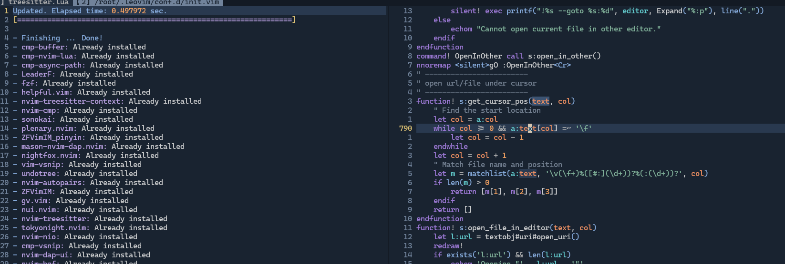
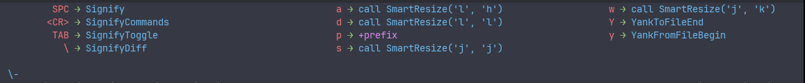
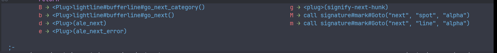
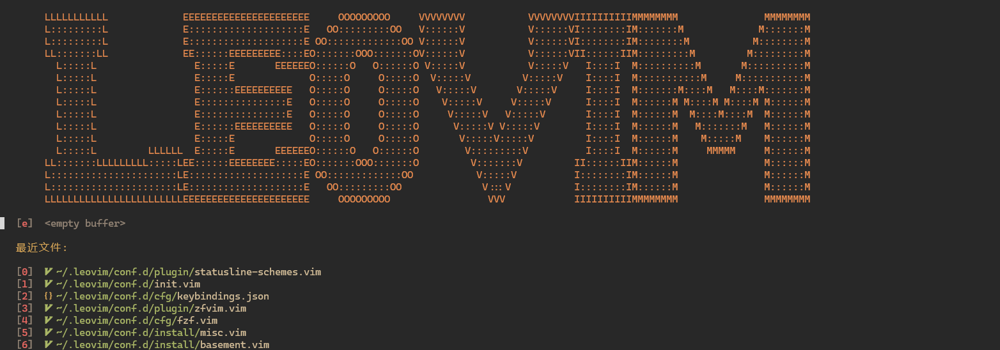
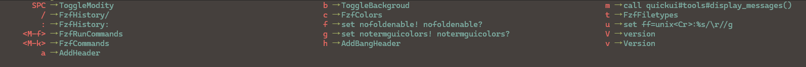
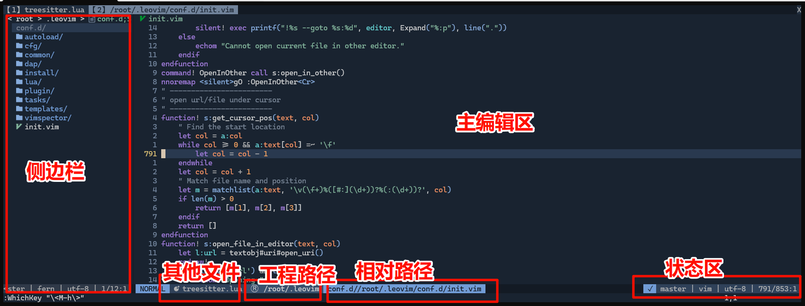
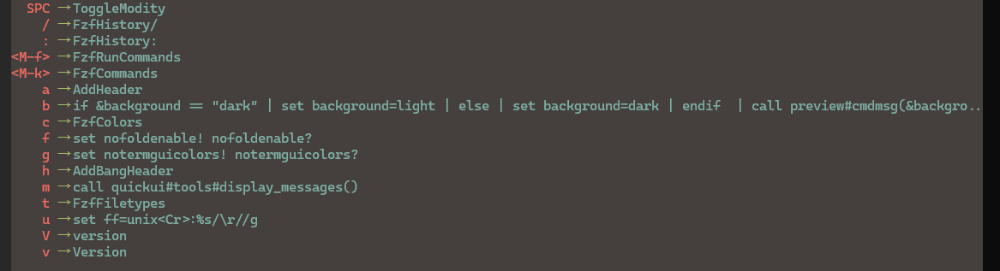

# 1. 前言

LeoVim 是一个面向开发人员的 Vim/Neovim 通用配置框架,旨在提供一个开箱即用、功能完备且高度可定制的编辑器环境。

## 1.1. 主要特点

- **通用性**: 同时支持 Vim 和 Neovim,在保持一致性的同时又能发挥各自优势
- **模块化**: 采用模块化设计,可以根据需要启用/禁用功能
- **易用性**: 提供直观的快捷键映射和友好的用户界面
- **可扩展**: 支持通过插件和自定义配置进行功能扩展
- **智能补全**: 集成多种补全引擎,提供智能的代码补全
- **语言支持**: 内置对多种编程语言的支持
- **调试集成**: 提供代码调试和 REPL 环境
- **搜索增强**: 强大的文本搜索和符号导航功能

## 1.2. 设计理念

- **开箱即用**: 合理的默认配置,安装后即可投入使用
- **渐进式学习**: 可以逐步掌握和使用更多高级功能
- **一致性**: 在不同环境下保持一致的使用体验
- **高效性**: 优化的性能和启动速度
- **可维护性**: 清晰的代码组织和完善的文档

## 1.3. 主要功能

- LSP 支持和智能补全
- 语法高亮和代码折叠
- 文件树和标签页管理  
- 模糊查找和全局搜索
- Git 集成
- 终端集成
- 代码片段
- 调试支持
- 多光标编辑
- 项目管理

## 1.4. 目标用户

- 需要一个功能完备的IDE环境的开发者
- 希望提高编码效率的Vim/Neovim用户
- 寻求可定制开发环境的程序员
- 需要跨平台开发环境的用户

# 2. 系统要求

- 操作系统和编辑器版本：
  - 对 `LINUX`、`WINDOWS`和 `MacOS`系统进行了支持
  - 需要 `vim7.4` 或 `neovim0.7.2`以上版本
- 建议安装软件以完成更复杂的功能
  - `git` 1.8.5以上版本
  - `Universal Ctags` 5.8 以上版本
  - `global gtags` 6.6.7 以上版本
  - `Node.js` 20.0以上版本
  - `tmux` 3.0以上版本
  - `python3` 3.8以上版本， 并且 `pip install neovim`, `pip install pygment`两个包。

# 3. 安装卸载转移

## 3.1. 基础安装
本程序采用一键式安装, linux下基础安装仅需要执行根目录下的 `install.sh` 脚本, 在windows下用`admin`权限通过执行 `install.cmd`进行安装。

### 3.1.1. 增强软件安装
在linux环境中通过在 `install.sh`后加上不同的参数，可完成增强功能的安装。
- ` neovim`: 强制安装最新版neovim
- ` nodejs`: 强制安装最新版nodejs
- ` nvim`: 安装最新版nvim
- ` rc`: 安装配置文件到 `~/.bashrc`，优化终端和命令
- ` z.lua`: 安装 `z.lua`, 一个增强的路径搜索工具
- ` leotmux`: 安装 `leotmux`, 一个增强的 tmux 终端管理工具。
- ` all`: 安装除 `leotmux`外所有增强功能， 但不强制安装 `neovm`和 `nodejs`
- 注：上述 ` all`和 ` rc`选项会安装美化并且加入大量新功能的 `~/.bashrc`, 在安装前会询问是否要替换原有配置文件。

### 3.1.2. 主要安装内容
#### 3.1.2.1. 创建必要的目录结构
- `~/.config/nvim`：Neovim 的配置目录
- `~/.local/bin`: 可执行文件的安装目录

#### 3.1.2.2. 复制基础工具脚本
- 复制 inputrc 到 `~/.inputrc`（终端输入配置）
- 复制 configrc 到 `~/.configrc`（通用配置）

#### 3.1.2.3. Vim/Neovim 环境配置
- 建立安装目录与 ~/.leovim 之间的软链接，
- 将 z.sh，nv.sh，ni.sh 复制到 `~/.local/bin`（增强程序）
- 创建和更新 `vim的 ~/.vimrc` 或者 `neovim的~/.conf/nvim/init.vim`配置文件，并加载上面的 `~/.leovim/conf.d/init.vim`配置文件完成初始化
- 创建 `~/.vimrc.opt`文件，此为本项目的功能开关文件，vim/neovim启动时会根据其内容安装加载不同的程序模块
- 使用插件管理器安装和更新插件

#### 3.1.2.4. 扩展功能安装
- 在有 `git`的可连接外同的环境下，会安装更多的增强插件, 以完成复杂的功能, 如下图
  

## 3.2. 卸载
- 运行根目录下的 `uninstall.sh` 。
- windows下执行 `uninstall.cmd`。

## 3.3. 打包转移
`scripts/compress.sh` 脚本用于将 LeoVim 配置文件和相关目录打包成一个 tar.gz 文件。该脚本会排除一些不必要的文件和目录，如 `.git`、`.gz`、`.bz2`、`.zip`、`.tags`、`.gtags` 等。具体打包的文件和目录包括：
- `.local/fzf`
- `.local/nvim*`
- `.local/node*`
- `.local/ctags`
- `.local/gtags`
- `.local/tmux`
- `.leovim.unix`
- `.leovim.d`
- `.leovim`

执行上述命令后，会在用户主目录下生成一个名为 `leovim.tar.gz` 的压缩文件, 再复制到其他主机解压并执行 `install.sh`即可完成软件和插件的转移。

# 4. 文件目录说明
## 4.1. `pack`基础包目录
- `pack` 目录是预安装目录，用于存放可以通过动态加载的模块集合，这种方式使得模块的加载更加灵活，提高启动速度。
- `pack` 目录下包含 `autoload`、`clone`、`colors`、`doc`、`fork`、`ftplugin`、`leo`、`plugin` 和 `syntax` 等子目录，为配色方案、文档、文件类型定义、运行模块、通用插件和文件模块等。

保证Leovim-IDE在没有网络无法安装增强插件的情况下，可以完成基本的IDE操作。
## 4.2. `conf.d`目录
- `conf.d` 目录是主要的程序目录，包含了以下子目录和文件：

### 4.2.1. 入口文件 `conf.d/init.vim:`

这是本软件的核心配置程序，是软件的入口，同时负责对环境进行检测和配置。

#### 4.2.1.1. 配置环境和版本检查

- 版本检查: 文件开始部分检查 Vim 或 Neovim 的版本，如果不满足要求的版本，则会显示错误信息并退出配置加载。
- 操作系统检测: 定义了几个函数来检测当前操作系统，以便后续根据不同的操作系统进行不同的配置。

#### 4.2.1.2. GUI 和终端环境设置

- GUI 设置: 针对 GUI 模式（如 GVim 或 Neovim GUI 版本），调整 GUI 选项以优化用户体验。
- Neovim 特定的设置: 如果使用 Neovim，文件会加载 Lua 配置模块并设置一些 Neovim 特有的选项。

#### 4.2.1.3. 目录设置

- 自定义目录: 定义了几个重要目录的环境变量，如插件安装目录、配置目录等，这有助于组织和管理配置文件和插件。

#### 4.2.1.4. 配置 Vim 运行时路径 (RTP) 和包路径:

- 设置 RTP: 将自定义的目录添加到 Vim 的运行时路径中，这允许 Vim 加载这些目录下的插件和脚本。
- 包管理: 使用 Vim 的内置包管理功能`packadd`来加载插件。

#### 4.2.1.5. 插件管理与加载

- 插件加载: 使用自定义命令 `PlugAddOpt` 来加载模块，例如 `vim-eunuch`, `conflict-marker.vim`, `nerdcommenter` 等。

#### 4.2.1.6. 快捷键映射

自定义映射: 定义了大量的键盘快捷键映射，覆盖了从基本编辑操作到插件功能调用等多种行为。例如：

- 重新映射 `<C-i>`, `<C-z>` 等。
- 增强了搜索功能，如 *, #, `<C-n>` 等。
- 设置了特定于某些文件类型或插件的快捷键。
- `<M-HJKL>`（注意是大写，下同）：往左下上右的panel间，以及tmux panel间跳转，相当于 `<C-w>hjkl`
- 在insert模式下的 `M-hjkl`, 相当于普通上下左右光标移动功能

#### 4.2.1.7. 自定义函数和命令

- 自定义函数: 提供了许多实用函数，如 `Trim()`, `Expand()`, `TripTrailingWhiteSpace()` 等，用于文本处理和配置管理。
- 自定义命令: 例如 YankWord, YankLine 等，用于增强 Vim 的默认行为。


### 4.2.2. 核心文件 `conf.d\cfg\main.vim`

#### 4.2.2.1. 设置运行时路径和编码等基本选项。

- `set rtp^=$CONF_D_DIR`:  `rtp` (runtimepath) 是 Vim 中用于查找各种文件（如插件、语法文件等）的路径列表。`^=` 操作符会将 `$CONF_D_DIR` 环境变量的值添加到 `rtp` 的开头，这意味着 Vim 会优先从这个目录加载配置，方便管理。
- `let &termencoding=&enc`:  `termencoding` 是 Vim 中用于设置终端编码的选项，而 `enc` 是 Vim 的内部编码选项。这行命令的作用是将终端编码设置为与 Vim 的内部编码相同。这样做可以避免因编码不一致而导致显示乱码或其他问题。

#### 4.2.2.2. 快捷键映射:

- Hack Vim/Neovim系统 ， 使得程序 可以支持 `Alt`键， 即 `<M-`开头的键映射
- 定义了大量以 `<M-` 开头的快捷键，用于快速执行各种 Vim 命令，例如全选、移动光标、进入命令模式等。

#### 4.2.2.3. Python 支持:

- 自动检测 Python 解释器和版本，并配置 pygments 和 pretty_errors 等 Python 工具的集成。

#### 4.2.2.4. 终端和 GUI 支持:

- 根据 Vim 的类型 (终端或 GUI) 以及操作系统进行不同的配置，例如设置真彩色、全屏模式和透明度。

#### 4.2.2.5. 代码标签支持:

- 配置 ctags 和 gtags，用于代码导航和补全。

#### 4.2.2.6. 插件管理:

- 使用 `vim-plug` 管理模块，并加载相关的配置函数。

#### 4.2.2.7. 环境变量设置：

- 根据操作系统设置 `$PATH` 环境变量，以便 Vim 可以找到外部工具。

### 4.2.3. 辅助目录

- `install/:`  存放安装相关的脚本，例如增强补全配置、语言支持、和一些额外的功能配置。
- `tasks/:`  存放任务配置，可以定义一些常用的构建、测试等任务。
- `templates/:`  存放各种模板文件，例如 `.gitignore`、`.lintr` 等。
- `dap/:`  存放调试适配器 (DAP) 的相关配置，用于配置不同语言的调试环境。
- `vimspector/:`存放 Vimspector 调试器的配置。
- `snippets/:`存放vscode格式的代码片断 

## 4.3. 其他目录

- `fonts/:`  存放自定义字体文件。
- `scripts/:`存放一些脚本文件，例如用于安装、卸载、代码检查等功能的脚本。
- `snippets/:`存放代码片段，用于快速插入常用代码块。

# 5. 操作说明

## 5.1. 原生键位修改

vim原生键位功能有一些冗余，且占据了黄金位置，为了充分利用，本软件进行了修改，主要如下。

- `H/L`: 移动到行头/行尾
- `S/s`: buffer 内部跳转和textobj功能
- `|`: buffer内搜索功能
- `q`映射到 `M`: 宏录制用
- select状态的 `Enter`: 利用原生能力增强的搜索/替换
- `;`和 `,`，主要切换状态、跳转符号、搜索等。

## 5.2. 先导键

### 5.2.1. 内置先导键

在 Vim 中，mapleader 和 localmapleader 是用于自定义键映射的前缀键，核心作用是为你自定义的全局快捷键提供一个命名空间或者说"入口点"。它们允许你创建自己的快捷键组合完成复杂的功能。在本程序中，mapleader 默认为 `空格`，是最主要全局 `先导`。localmapleader 默认为 `q`，在不同的文件类型里有不同的作用。

```
let g:mapleader = ' '
let g:maplocalleader = 'q'
```

### 5.2.2. 增强先导键

除上述两个键位外，还利用

* `<Tab>` 和 `\`，它们是 Vim 的内置键位，主要用于导航和状态切换。
* `]` 和 `[`，次要的跳转功能（`;`,`,`是主要的跳转功能）, 以及编码状态切换。

本程序还Hack `Alt`+部分键位来完成一些功能(显示键位为 `<M-` 开头)，如：

- `<M+l>`: lsp 补全引擎功能和line切换功能。
- `<M+j>`: 跳转到功能。
- `<M+k>`: 部分功能开关。
- `<M+h>`: 打开重点配置文件。
- `<M+d>`: debug相关。
- `<M+e>`: repl 即步执行功能。
- `<M+r>`: 运行相关。

### 5.2.3. 操作提示

在本软件中，因为可用的自定义键位多达上百，又没有传统ide的菜单，因此要使用 `提示窗口`来进行操作帮助。在按下上述的先导键后，会弹出一个提示框，提示你当前可用的快捷键。
如下图就是按下 `\`后弹出的提示框, 主要为屏幕panel调整，状态切换

再如下图就是 `;`的作用，为buffer切换，mark标识、错误跳转等


# 6. 主要功能

## 6.1. 启动首页

在终端输入 `vim`, 或安装 `neovim`并且安装 `install.sh bashrc`后，可用alias命令 `vi`, `nv`, `nvi`启动，出现首页显示近期文件等，可按数字键选择文件


## 6.2. 辅助功能开关

按 `<M-z`>切换软换行， 按 `<M-k>` 作先导键可完成更复杂的功能，如下所示。



其中

- `Space`: 切换当前文件可编辑状态
- `Fzf`系列命令：用fzf进行各种功能的回溯、选择
- `a`和 `h`: 对文件头部信息进行操作
- `b`和 `c`: 主题相关

## 6.3. 状态显示

如下图，在打开多个文件后，可大致把页面分成左边的侧栏，下方文件栏，上方标题栏（全路径），下右状态栏（显示git branch, 文件类型，编码和位置。


## 6.4. 文件导航和切换

### 6.4.1. 文件保存

- `<C-s>`: 保存当前文件。
- `<Leader> w`: 保存所有文件。

### 6.4.2. 文件比较

- `<Leader> fv`: 打开文件比较模式，需要提供两个文件名。
- 用法: `DiffVsp <left_file> <right_file>`

### 6.4.3. 文件路径和目录

- **获取根目录**:
  - `<M-h> R`: 显示当前文件的根目录。
- **更改目录**:
  - `cdr`: 更改到当前文件的根目录。
  - `cdl`: 更改到当前文件的目录。
- **打开文件**:
  - `<M-j>e`: 打开文件。
  - `<M-j>t`: 在新标签页中打开文件。
  - `<M-j>s`: 在新窗口中打开文件。
  - `<M-j>v`: 在垂直分割窗口中打开文件。
- **文件浏览器**:
  - `<Leader>e`: 打开文件浏览器。
  - `<Leader>ff`: 打开文件搜索。
  - `<Leader>p`: 打开 Git 文件搜索。
  - `<Leader><Enter>`: 重新加载当前文件。
  - `<Leader>E`: 打开Project文件选择器。
  - `<Leader>P`: 打开GitRoot文件选择器。

### 6.4.4. 文件创建和打开

- **创建或打开文件**:
  - `<M-h>S`: 打开或创建 `~/.ssh/config` 文件。
  - `<M-h>G`: 打开或创建 `~/.gitconfig` 文件。
  - `<M-h>B`: 打开或创建 `~/.bashrc` 文件。
  - `<M-h>C`: 打开或创建 `~/.configrc` 文件。
  - `<M-h>t`: 打开或创建 `TODO.md` 文件。
  - `<M-h>r`: 打开或创建 `README.md` 文件。
  - `<M-h>g`: 打开或创建 `.gitignore` 文件。
  - `<M-h>w`: 打开或创建 `.wildignore` 文件。
- **打开配置文件**:
  - `<M-h><Enter>`: 重新加载 `~/.leovim/conf.d/init.vim` 文件。
  - `<M-h>o`: 打开 `~/.vimrc.opt` 文件。
  - `<M-h>i`: 打开 `~/.leovim/conf.d/init.vim` 文件。
  - `<M-h>I`: 打开 `~/.leovim/conf.d/install/install.vim` 文件。
  - `<M-h>k`: 打开 `~/.leovim/conf.d/keybindings.json` 文件。
  - `<M-h>v`: 打开 `~/.leovim/conf.d/vscode.vim` 文件。
  - `<M-h>m`: 打开 `~/.leovim/conf.d/main.vim` 文件。
  - `<M-h>O`: 打开 `~/.leovim/conf.d/opt.vim` 文件。
  - `<M-h>f`: 打开 `~/.leovim/conf.d/plugin/file.vim` 文件。
  - `<M-h>a`: 打开 `~/.leovim/conf.d/autoload` 目录中的文件。
  - `<M-h>c`: 打开 `~/.leovim/conf.d/common` 目录中的文件。
  - `<M-h>p`: 打开 `~/.leovim/conf.d/plugin` 目录中的文件。
  - `<M-h>d`: 打开 `~/.leovim/conf.d` 目录中的文件。
  - `<M-h>l`: 打开 `~/.leovim` 目录中的文件。
  - `<M-h>L`: 打开 `~/.local/bin` 目录中的文件。
  - `<M-h>A`: 打开或创建 `~/.leovim.d/after.vim` 文件。
  - `<M-h>P`: 打开或创建 `~/.leovim.d/pack.vim` 文件。

### 6.4.5. 缓存文件清理

- **删除临时文件**:
  - `<Leader> x`: 删除临时文件。

### 6.4.6. 文件模板

- **自动创建文件模板**:
  - `.lintr` 文件: `BufNewFile .lintr 0r $CONF_D_DIR/templates/lintr.spec`
  - `.Rprofile` 文件: `BufNewFile .Rprofile 0r $CONF_D_DIR/templates/Rprofile.spec`
  - `.gitconfig` 文件: `BufNewFile .gitconfig 0r $CONF_D_DIR/templates/gitconfig.spec`
  - `.gitignore` 文件: `BufNewFile .gitignore 0r $CONF_D_DIR/templates/gitignore.spec`
  - `.wildignore` 文件: `BufNewFile .wildignore 0r $CONF_D_DIR/templates/wildignore.spec`
  - `.radian_profile` 文件: `BufNewFile .radian_profile 0r $CONF_D_DIR/templates/radian_profile.spec`

### 6.4.7. 缓冲区操作

- **缓冲区切换**:
  - `<Leader> b`: 切换缓冲区。
  - `;b`: 切换到下一个缓冲区。
  - `,b`: 切换到上一个缓冲区。
  - `;B`: 切换到下一类缓冲区。
  - `,B`: 切换到上一类缓冲区。
- **移动缓冲区**:
  - `]b`: 移动到下一个缓冲区。
  - `[b`: 移动到上一个缓冲区。
  - `[B`: 移动到第一个缓冲区。
  - `]B`: 移动到最后一个缓冲区。
- **关闭缓冲区**:
  - `<Leader> Q`: 关闭当前缓冲区。
  - `<Leader> B`: 关闭其他所有缓冲区。

### 6.4.8. 标签页操作

- **标签页切换**:
  - `<M-n>`: 切换到下一个标签页。
  - `<M-p>`: 切换到上一个标签页。
  - `<M-1>` 到 `<M-9>`: 切换到指定编号的标签页。
  - `<M-0>`: 切换到最后一个标签页。
- **关闭标签页**:
  - `<M-w>`: 关闭当前标签页。
  - `<M-W>`: 关闭其他所有标签页。

### 6.4.9. 窗口操作

- **调整窗口大小**:
  - `\a`: 向左调整窗口大小。
  - `\d`: 向右调整窗口大小。
  - `\w`: 向上调整窗口大小。
  - `\s`: 向下调整窗口大小。
  - `<Tab>k`: 向上调整窗口大小。
  - `<Tab>j`: 向下调整窗口大小。
- **打开新窗口**:
  - `<Tab>v`: 垂直分割窗口。
  - `<Tab>x`: 水平分割窗口。
- **窗口控制**:
  - `<M-Q>`: 关闭前一个窗口。
  - `<M-U>`: 在前一个窗口向上滚动半页。
  - `<M-D>`: 在前一个窗口向下滚动半页。
  - `<M-E>`: 在前一个窗口向下滚动一行。
  - `<M-Y>`: 在前一个窗口向上滚动一行。

## 6.5. 代码运行与编译

### 6.5.1. 功能概述

* 主要配置了 `asyncrun.vim` 和 `asynctasks.vim` 两个模块。
* `asyncrun.vim` 用于异步执行命令。
* `asynctasks.vim` 用于定义和管理异步任务。
* 此外，还包含一些与终端窗口管理相关的配置，特别是与 `floaterm.vim` 插件的集成。

### 6.5.2. 异步运行配置

* 窗口大小设置
  * 定义了一个自动命令 `SetRunOpen`，在 Vim 窗口大小改变或进入时调用 `s:SetRunRows()` 函数。
  * `s:SetRunRows()` 函数根据窗口行数动态设置 `g:asyncrun_open` 变量，用于控制异步执行结果窗口的高度。
* 命令映射
  * 定义了 `!` 键用于执行 `AsyncRun` 命令，在可视模式下可以运行选中的文本。
  * `<Tab>q` 和 `<Tab>Q` 用于停止正在运行的异步任务。
  * `<M-r>` 用于以原始模式运行异步命令。
* 不同系统下的命令配置
  * 根据操作系统设置 `asyncrun_encs` 变量，用于指定字符编码。
  * 定义了不同编程语言的编译和运行命令，例如 C/C++、Rust，并考虑了 Windows 和 Unix 平台。
* ``s:asyncrun ` 函数`
  * 该函数是异步运行命令的核心函数。
  * 根据文件类型 (`&ft`) 和用户指定的参数，构建并执行相应的命令。
  * 支持在 quickfix 窗口、终端窗口和浮动终端窗口中显示运行结果。
  * 针对不同的文件类型，定义了不同的运行命令，例如 Python、Go、JavaScript 等。
* 快捷命令
  * 定义了 `RunQfSilent`、`RunQfBottom` 和 `RunQfRight` 等命令，用于在不同的 quickfix 窗口位置显示异步运行结果。

### 6.5.3. 浮窗集成

* 定义了 `s:floaterm_run` 函数，用于在浮动终端窗口中运行命令。
* 支持在右侧、底部和浮动窗口中打开浮动终端。
* 定义了 `TaskTestOrTab`、`TaskRunOrRight` 等命令，用于运行预定义的异步任务，并将其结果显示在不同的终端窗口中。
* 映射了 `<M-T>`、`<M-R>`、`<M-B>` 和 `<M-F>` 等快捷键，用于快速执行这些任务。
* 定义了 `SmartRunTerm` 函数，可以根据屏幕尺寸智能地选择浮动终端的位置。

### 6.5.4. 任务配置

* 定义了 `g:asyncrun_rootmarks`、`g:asynctasks_config_name` 等变量，用于配置 `asynctasks.vim` 模块。
* 定义了 `AsyncTaskDeploy`、`AsyncTaskCommon` 和 `AsyncTaskTemplate` 等命令，用于打开和编辑异步任务配置文件。
* 映射了 `<leader>r<Cr>`、`<leader>r<Tab>` 和 `<leader>r<Space>` 等快捷键，用于快速访问这些命令。
* 定义了 `AsyncTaskCommands` 命令，用于列出所有可用的异步任务。
* 映射了 `<leader>ra`、`<leader>rm` 和 `<leader>re` 等快捷键，用于执行与异步任务相关的操作。
* 定义了 `<leader>ri`、`<leader>rr` 等快捷键，用于快速运行预定义的项目相关任务。
* 定义了 `AsyncTaskProfileLoop` 命令，用于循环切换异步任务的 profile。
* 如果安装了 `fzf.vim` 插件，则会定义 `FzfAsyncTasks` 命令，用于使用 Fzf 查找和运行异步任务。

### 6.5.5. 基础运行命令

- `<M-r>` - 运行当前文件
- `<M-B>` - 在底部窗口运行
- `<M-R>` - 在右侧窗口运行
- `<M-F>` - 静默运行
- `<Tab>q` - 停止当前运行任务
- `<Tab>Q` - 强制停止任务

### 6.5.6. 智能运行模式

根据有没有定义任务智能运行：

- 底部终端或者Build任务: `<M-B>`
- 右侧终端或者Run任务: `<M-R>`
- 浮动终端或者Finalize任务: `<M-F>`
- 外部终端或者Test任务: `<M-T>`

### 6.5.7. 可视化任务选择

可fuzzy选择任务


## 6.6. 调试与REPL


### 6.6.1. J 命令相关

- 定义了 `s:diag_or_errmsg` 函数，用于根据条件调用不同的诊断信息显示方法。
- 定义了 `s:j` 函数，用于处理行连接或显示诊断信息。
- `J` 按据具有双重功能：在启动debug模式下为临时显示变量，普通情况下显示代码检查信息。

### 6.6.2. 通用调试功能

- 定义了 `s:watch` 函数和 `WatchCword` 命令，以及相关的快捷键，用于在调试过程中观察变量。

### 6.6.3. Debug: load_json

- 定义了 `s:load_json` 函数，用于加载 `dap` 或 `vimspector` 的 JSON 配置文件。
- `-`用于watch 某个变量, 在对应的watch窗口, 用`x`删除

### 6.6.4. Vimspector 调试器相关

- 如果安装了 `vimspector`，则设置 `g:debug_tool` 为 "vimspector"，并配置了一些 `vimspector` 的选项和快捷键，包括：
  - 加载和打开 `vimspector` 配置文件的命令和快捷键。
  - 启动、停止、继续、单步调试等调试操作的快捷键。
  - 跳转到 `vimspector` 不同窗口的快捷键。
  - 一些特殊的功能映射。

### 6.6.5. nvim-dap 调试器相关

- 如果安装了 `nvim-dap` 及其相关插件，则设置 `g:debug_tool` 为 'nvim-dap'，并加载 `dap_cfg` 模块。
- 配置了加载和打开 `dap` 配置文件的命令和快捷键。
- 定义了各种调试操作的快捷键，类似于 `vimspector`。
- 配置了 `nvim-dap-ui` 的相关快捷键，用于显示不同的调试 UI 元素。

### 6.6.6. F1-F12 快捷键映射

- F1:  如果安装了 vimspector，则执行 `<Plug>VimspectorDisassemble` 命令。如果安装了 nvim-dap，则执行 `<Cmd>DapReplToggle<Cr>` 命令。
- F2:  利用lsp的rename操作。
- F3:  停止调试
- F4:  运行到光标位置
- F5:  开始Debug/继续debug
- F6:  pause Debug
- F7:  上个断点
- F8:  下个断点。
- F9:  切换断点。
- F10: StepOver。
- F11: StepInto。
- F12: StepOut。

### 6.6.7. REPL 交互

此模块通过提供将代码发送到不同语言的环境的功能来实现REPL （读取-求值-打印循环）功能,  先导键为 `<M-e>` 键。



* **REPL 程序定义：** 该插件为各种语言（Python、R、Shell、PHP、PowerShell、Perl、Lua、Vim、Ruby、Julia、JavaScript）定义了常用 REPL 程序的列表。它使用
  `floaterm#repl#add_program` 函数将文件类型与其对应的 REPL 命令关联起来。这使得插件能够根据当前文件的类型自动启动正确的 REPL 环境。
* **块标记：** 该插件支持使用特殊的注释标记（例如，Python 的 `# %%`）标记代码块。这允许用户轻松地将特定的代码块发送到 REPL。`g:floaterm_repl_block_mark`
  变量存储了不同文件类型的这些标记。
* **清除和退出命令：** 该插件定义了用于清除 REPL 屏幕和退出不同语言的 REPL 环境的命令。这些命令存储在 `g:floaterm_repl_clear` 和 `g:floaterm_repl_exit`
  变量中。
* **终端管理：** 该插件使用 `vim-floaterm` 来管理 REPL 终端。它使用 `t:floaterm_repl_termnames` 跟踪与每个文件类型和缓冲区关联的终端名称。
* **发送代码：** 该插件提供了各种将代码发送到 REPL 的命令：
  * `FloatermReplStart`：启动当前文件类型的 REPL。
  * `FloatermReplSend`：将当前行或选定的行发送到 REPL。
  * `FloatermReplSendVisual`：将视觉上选定的行发送到 REPL。
  * `FloatermReplSendBlock`：将当前代码块发送到 REPL。
  * `FloatermReplSendFromBegin`：将从文件开头到当前行的代码发送到 REPL。
  * `FloatermReplSendToEnd`：将从当前行到文件末尾的代码发送到 REPL。
  * `FloatermReplSendAll`：将整个文件内容发送到 REPL。
  * `FloatermReplSendNewlineOrStart`：向 REPL 发送换行符，或者如果 REPL 尚未运行则启动它。
  * `FloatermReplSendClear`：向 REPL 发送清除命令。
  * `FloatermReplSendExit`：向 REPL 发送退出命令。
  * `FloatermReplSendWord`：将光标下的单词发送到 REPL。
* **标记和发送标记的代码：** 该插件允许用户标记代码块（通过视觉方式或块标记），然后使用 `FloatermReplMark` 和 `FloatermReplSendMark` 将标记的代码发送到 REPL。

## 6.7. 代码补全


- 默认会使用内置 `vim-mucomplete`模块进行补全，只有内置dict、buffer、path和 dict补全。
- 在高级版本的vim/neovim中, 在软件条件符合的情况下，可以使用 `coc.nvim`, `nvim-cmp`进行补全，会利用 `lsp`引擎完成对更完整的补全功能。

### 6.7.1. 补全按键

- `<Tab>` - 触发补全
- `<C-n>` - 下一个补全项
- `<C-p>` - 上一个补全项
- `<CR>` - 确认选择

### 6.7.2. `conf.d/cfg/coc.vim`

这个文件配置了 `coc.nvim` 插件，它为 Vim 提供了代码补全、诊断、格式化和其他语言服务器协议 (LSP) 支持的功能。

* **coc-global-extensions**:  定义了 `coc.nvim` 启动时默认安装的全局扩展列表。根据不同的条件（操作系统、是否为 Neovim、是否启用了特定功能）添加不同的扩展。例如，在 UNIX 系统上添加 `coc-lua`，在 Windows 上添加 `coc-powershell`，如果安装了 Neovim，则添加 `coc-explorer` 和 `coc-symbol-line`。还根据 `Require` 函数的返回值来决定是否安装与 Web 开发、C/C++、R、Rust、Java 和写作相关的扩展。
* **map**:  映射了多个快捷键来执行 `coc.nvim` 的各种操作。例如，`<M-l>i` 用于显示 `CocInfo`，`<M-l>r` 用于重启 `coc.nvim`，`<M-V>` 用于使用 FZF 列出 yank 历史，等等。还包括用于显示符号、代码完成和滚动的快捷键映射。可以按下 `<M-l>`后看提示信息。
* **actions**:  配置了 `coc.nvim` 的代码操作相关功能。映射 `<C-q>` 来格式化选定的代码或整个文件。定义了 `Format`、`Fold` 和 `OR` 命令来执行格式化、折叠和组织导入操作。
* **inlayHint/codeLens/codeaction**:  配置了 inlay hint、codeLens 和 code action 功能。根据 Vim 版本启用或禁用 inlay hint 和 codeLens，并映射了快捷键来切换它们的状态。还映射了快捷键来执行重命名、快速修复、代码操作和 codelens 操作。
* **textobject using coc lsp**:  映射了快捷键来使用 `coc.nvim` 提供的基于 LSP 的文本对象。
* **others**:  设置了其他 LSP 相关的功能。例如，为 hover 和 signatureHelp 弹出窗口添加了边框，并设置了 signatureHelp 的关闭事件。

### 6.7.3. `conf.d/lua/lsp.lua`

这个文件使用 Lua 语言配置了与 Language Server Protocol (LSP) 相关的功能。

* **symbol usage**:  配置了 `symbol-usage.nvim` 插件，用于在编辑器中显示符号的使用情况。定义了不同的高亮组用于区分不同类型的符号使用（例如，引用、定义、实现），并提供了一个 `text_format` 函数来自定义显示文本的格式，包括引用次数和实现信息。禁用了部分 LSP 客户端和文件类型的符号使用显示。
* **mason lspconfig**:  配置了 `mason-lspconfig.nvim` 插件，用于管理和配置 LSP 服务器。设置了默认的 LSP 服务器配置处理程序，并为 `lua_ls`、`gopls` 和 `jdtls` 提供了特定的配置。例如，为 `lua_ls` 添加了全局变量 `vim`，为 `gopls` 启用了额外的代码分析和代码提示功能。
* **lspui**:  配置了 `LspUI` 插件，提供了一个用户界面来与 LSP 功能进行交互。定义了快捷键用于在主窗口和辅助窗口中执行不同的操作，例如跳转到定义、查找引用、切换折叠等。提供了 `LspUIApi` 和 `LspHandler` 函数来调用 `LspUI` 的 API 并处理 LSP 请求结果。
* **lsp attach**:  创建了 `LspAttach` 自动命令，用于在 LSP 客户端连接到缓冲区时执行一系列操作。这包括设置 `omnifunc` 和 `tagfunc`，映射快捷键来触发 LSP 功能（如重命名、代码操作、查看信息、重启 LSP），配置代码大纲工具 `vista.vim`，映射快捷键来浏览诊断信息，以及配置原生 LSP 功能的快捷键（如格式化、查看工作区符号）。还处理了选择范围、语义 token 高亮、 inlay hint 和 codelens 的配置和快捷键映射。此外，还映射了 `<leader>A` 来使用 `lspimport` 插件导入依赖，并映射了 `<leader>R` 来切换符号使用情况的显示。
* **winbar**:  配置了 `winbar.nvim` 插件，用于在窗口顶部显示当前文件的路径和符号信息。可以自定义颜色和图标，并排除某些文件类型。
* **others**:  设置了其他 LSP 相关的功能。例如，为 hover 和 signatureHelp 弹出窗口添加了边框，并设置了 signatureHelp 的关闭事件。

### 6.7.4. conf.d/lua/cmp_cfg.lua

这个文件使用 Lua 语言配置了 `nvim-cmp` 插件，它是一个用于 Vim 和 Neovim 的可扩展的补全框架。

* **cmp config**:  配置了 `nvim-cmp` 插件的各种选项。
  * **sources**:  定义了补全的来源及其优先级。例如，`nvim_lua` 的优先级最高，而 `async-path` 的优先级最低。如果安装了 `jupynium.nvim`，则会将其添加到来源列表中。
  * **snippet**:  配置了代码片段的展开方式，这里使用 `vsnip` 插件来展开代码片段。
  * **sorting**:  定义了补全项的排序方式，包括基于得分、最近使用、局部性、类型等多种比较器。
  * **window**:  配置了补全和文档弹出窗口的边框样式。
  * **mapping**:  定义了各种快捷键映射，用于在补全菜单中进行导航、选择、取消等操作。这些映射针对不同的模式（普通模式、命令行模式、插入模式）进行了配置。例如，`<C-n>` 和 `<C-p>` 用于在补全菜单中上下移动，`<Tab>` 用于选择下一个补全项或触发代码片段展开。
  * **formatting**:  配置了补全项的格式，使用 `lspkind-nvim` 插件来显示类型图标。自定义了补全项的标签显示，如果标签过长则会截断并添加省略号，并在菜单中显示补全来源。
* **cmdline**:  分别配置了命令行模式下 `/` 和 `?` 搜索以及 `:` 命令的补全来源。

## 6.8. 检查功能

### 6.8.1. 通用功能:

- `s:python_lint_ignore`: 定义了 Python 代码检查器忽略的错误代码列表。
- `g:diagnostic_virtualtext_underline`:  尝试设置全局变量，用于控制诊断信息的虚拟文本下划线显示。
- `<leader>o`:  切换诊断功能的启用状态。
- `<leader>O`:  切换诊断信息高亮显示方式。
- `<leader>d`:  打开包含当前缓冲区诊断信息的位置列表。
- `<leader>D`:  打开包含整个工作区诊断信息的位置列表。
- ;d `(下一个诊断),`,d `(上一个诊断),`;e `(下一个错误),`,e` (上一个错误)。

### 6.8.2. nvim-lsp 配置:

- 切换诊断:
  - `vim.g.diagnostics_enable`:  全局变量，用于启用或禁用诊断功能。
  - `toggle_diagnostics()` 函数:  切换 `vim.g.diagnostics_enable` 的状态，并使用 `vim.diagnostic.enable()` 和 `vim.diagnostic.disable()` 函数来实际启用或禁用诊断。
  - **快捷键:** `<leader>o` 映射到此功能。
- 切换诊断高亮:
  - `vim.g.diagnostic_virtualtext_underline`: 全局变量，用于控制诊断信息的虚拟文本和下划线显示。
  - `toggle_diagnostics_highlight()` 函数: 切换 `vim.g.diagnostic_virtualtext_underline` 的状态，并使用 `vim.diagnostic.config()` 函数来配置 `virtual_text` 和 `underline` 选项。
  - **快捷键:** `<leader>O` 映射到此功能。
- 诊断配置:
  - `vim.diagnostic.config({...})`:  配置诊断功能的全局行为，例如禁用虚拟文本和下划线，并设置浮动窗口的边框样式为 "single"。

### 6.8.3. coc.nvim 配置:

- 诊断显示控制:
  - 如果 `g:linter_tool == 'ale'`，则配置 `coc.nvim` 使用 `ale` 来显示诊断信息。
  - 否则，定义 `s:Diagnostics()` 函数来调用 `CocDiagnostics` 显示诊断，并根据是否使用 `leaderf` 以及是否是 Neovim 来决定是否打开 quickfix 或 locationlist。
- 显示诊断信息:
  - **快捷键:** `<M-l>d`，用于显示光标下诊断信息的详细内容。

## 6.9. 符号查找

### 6.9.1. 基础符号显示

- `<C-t>`: 在侧边栏中显示符号信息。
  
- `f/F<Cr>`、`t/T<Cr>`: 在浮动窗口显示函数/符号信息 。
- `<leader>t`、`<leader>T`: 利用lsp或者ctags显示符号信息。
  

### 6.9.2. 符号搜索功能

这部分定义了一个核心函数 `s:lsp_tag_search(method, ...)`，用于根据配置和插件，使用 LSP 或 tags 来查找符号定义、引用等。

- 该函数首先获取光标下的词作为要查找的符号。
- 如果 `method` 是 `preview`，则尝试使用进行预览。
- 否则，根据 `method` 的值（definition, references 等）进行相应的查找。
- 符号查找采用三层查找机制，按以下顺序尝试：
  1. **LSP查找**：优先使用LSP进行查找，根据配置可能使用以下两种方式之一：
     - 如果安装了`coc.nvim`，使用CocAction进行符号查找
     - 如果安装了Neovim LSP，使用`vim.lsp.buf`相关函数进行符号查找
  2. **Tags查找**：如果LSP查找失败且配置了ctags，则调用 `s:find_with_ctags` 函数使用 ctags 进行查找
  3. **全局搜索**：如果上述两种方法都失败，则执行 `g:search_all_cmd` 命令进行全局文本搜索
- 定义了多个快捷键，用于调用以不同的方式查找符号（预览、定义、引用等）。快捷键的映射会根据是否启用了高级补全引擎而有所不同。
  - `<C-h>`: Hover符号定义。
  - `<M-c>`: 预览符号定义。
  - `<M-C>`: 预览符号声明。
  - `<M-.>`: 预览符号实现。
  - `<M-/>`: 预览符号引用。
  - `<M-?>`: 预览符号类定义。
  - `<C-g>`: 跳转符号定义。
  - `<C-]>`: 在侧边栏跳转符号定义。
  - `<C-w><C-g>`: 在新窗口跳转符号定义。
  - `<C-w><C-]>`: 在下方栏跳转符号定义。

## 6.10. 文本对象

Vim 的文本对象（Text Objects）是 Vim 编辑器中一个非常强大的功能，允许用户以一种更自然的方式操作文本块。文本对象使你能够快速选择、删除、更改或移动特定类型的文本结构，如单词、段落、句子、括号内的内容等


### 6.10.1. 基本操作

- **快捷键映射**:  定义了许多以 `<leader>v` 开头的快捷键，用于选择不同类型的文本对象。例如，`<leader>vf` 用于选择一个函数外部的文本对象，`<leader>vF` 用于选择一个函数内部的文本对象。
- **自定义行文本对象**:  定义了名为 `line` 的自定义文本对象，并将其映射到 `ik` (内部行) 和 `ak` (周围行)。它使用 `CurrentLineA` 和 `CurrentLineI` 函数来确定行的范围。
- **自定义块文本对象**: 定义了名为 `block` 的自定义文本对象，用于选择由特定模式分隔的代码块，并将其映射到 `iv` (内部块) 和 `av` (周围块)。它使用 `BlockA` 和 `BlockI` 函数来确定块的范围，这些函数使用搜索来查找以 `# In[...]`, `# %%`, 或 `# STEP` 开头的行。

### 6.10.2. 高级操作

`conf.d/lua/treesitter.lua` 文件则主要负责配置 `nvim-treesitter` 模块，这是实现高级文本对象功能的核心。

- `incremental_selection`: 启用增量选择功能，并配置了相关的快捷键，例如 `<M-s>` 用于初始化和扩展选择，`<Tab>` 和 `<M-S>` 用于增减选择的节点。
- `fold`: 启用代码折叠功能。
- `textobjects`: 这是配置文本对象的关键部分。它定义了用于选择（`select`）和移动（`move`）文本对象的快捷键。

#### 6.10.2.1. 选择文本对象 (Select):

- `af`: 选择一个函数外部的文本。
- `if`: 选择函数内部的文本。
- `ac`: 选择一个类外部的文本。
- `ic`: 选择类内部的文本。
- `aL`: 选择一个循环外部的文本。
- `iL`: 选择循环内部的文本。
- 可以通过 `v` (字符选择), `V` (行选择), `<C-v>` (块选择) 等模式后接以上快捷键来选择不同类型的文本对象。 例如 `vac` 选择整个类。

#### 6.10.2.2. 跳转到文本对象 (Move):

这些快捷键利用了 `nvim-treesitter` 强大的语法解析能力，可以精确地识别代码结构，从而实现更智能的文本操作。

- `;f`: 跳转到下一个函数的开头。
- `;c`: 跳转到下一个类的开头。
- `;l`: 跳转到下一个循环的开头或结尾。
- `;z`: 跳转到下一个代码折叠的开始。
- `,f`: 跳转到上一个函数的开头。
- `,c`: 跳转到上一个类的开头。
- `,l`: 跳转到上一个循环的开头或结尾。
- `,z`: 跳转到上一个代码折叠的开始。
- `;F`: 跳转到下一个函数的结尾。
- `;C`: 跳转到下一个类的结尾。
- `,F`: 跳转到上一个函数的结尾。
- `,C`: 跳转到上一个类的结尾。
- `;o`: 跳转到下一个条件语句的开头或结尾。
- `,o`: 跳转到上一个条件语句的开头或结尾。

## 6.11. 搜索功能

### 6.11.1. 基本搜索

在选中状态下， 按 `s`或者 `<Enter>`会启动buffer内的搜索功能。

### 6.11.2. 主要快捷键及其功能

* `<M-l><M-l>`:
  * 如果安装了 `fzf`，则使用 `FzfBLines` 在当前 buffer 中搜索行。
  * 如果安装了 `leaderf`，则使用 `Leaderf line` 在当前 buffer 中进行模糊搜索。
  * 否则，使用 `CtrlPLine` 在当前 buffer 中搜索行。
* `<M-l><M-a>`:
  * 如果安装了 `leaderf`，则使用 `Leaderf line --all` 在所有 buffer 中进行模糊搜索。
  * 如果安装了 `fzf`，则使用 `FzfLines` 在所有 buffer 中搜索行。
* `\|`: 在普通模式下，使用当前光标下的词语在当前 buffer 中进行搜索。
* `<Visual>\|`: 在可视模式下，使用选中的文本在当前 buffer 中进行搜索。
* `<leader>\|`: 在普通模式下，使用当前光标下的词语在当前 buffer 中进行搜索 (与 `\|` 相同，但使用了 `<leader>` 键)。
* `<Visual><leader>\|`: 在可视模式下，使用选中的文本在当前 buffer 中进行搜索 (与 `<Visual>\|` 相同，但使用了 `<leader>` 键)。
* `s<Cr>`: 在普通模式下，使用当前光标下的词语进行全局搜索。
* `<Visual>s<Cr>`: 在可视模式下，使用选中的文本进行全局搜索。
* `s.`: 使用 `GrepAllLast` 命令，搜索上次全局搜索的关键词。
* `s/`: 在普通模式下，使用当前光标下的词语在当前目录下搜索。
* `<Visual>s\`: 在可视模式下，使用选中的文本在当前目录下搜索。
* `s[`: 使用 `GrepLast` 命令，搜索上次在当前目录搜索的关键词。
* `s]`: 使用 `Grep` 命令，搜索当前光标下的词语 (与 `s\` 相同)。
* `<leader>/`: 使用 `FzfSearch` 命令进行模糊搜索当前目录。
* `<leader>.`: 使用 `FzfSearchLast` 命令搜索上次 `fzf` 搜索的关键词。
* `<leader>\`: 在普通模式下，使用当前光标下的词语进行 `FzfSearch` 搜索。
* `<Visual><leader>\`: 在可视模式下，使用选中的文本进行 `FzfSearch` 搜索。
* `<Tab>/`: 使用 `FzfSearchGit` 命令在 Git 仓库中搜索。
* `<Tab>.`: 使用 `FzfSearchGitLast` 命令搜索上次 Git 搜索的关键词。
* `<Tab>\`: 在普通模式下，使用当前光标下的词语进行 `FzfSearchGit` 搜索。
* `<Visual><Tab>\`: 在可视模式下，使用选中的文本进行 `FzfSearchGit` 搜索。
* `q/`: 使用 `FzfSearchAll` 命令进行全局搜索。
* `q.`: 使用 `FzfSearchAllLast` 命令搜索上次全局搜索的关键词。
* `q\`: 在普通模式下，使用当前光标下的词语进行 `FzfSearchAll` 搜索。
* `<Visual>q\`: 在可视模式下，使用选中的文本进行 `FzfSearchAll` 搜索。
* `<leader>?`: 使用 `FzfSearchCommands` 命令搜索可用的 `fzf` 命令。
* `<C-f>.`: 使用 `Leaderf rg --recal` 重新加载 `leaderf` 缓存并进行搜索。
* `<C-f>;`: 使用 `Leaderf rg --next` 跳转到下一个搜索结果。
* `<C-f>,`: 使用 `Leaderf rg --previous` 跳转到上一个搜索结果。
* `<C-f>e`: 在普通模式下，使用 `Leaderf rg` 在底部打开，搜索当前光标下的词语。
* `<Visual><C-f>e`: 在可视模式下，使用 `Leaderf rg` 在底部打开，搜索选中的文本。
* `<C-f>b`: 在普通模式下，使用 `Leaderf rg --all-buffers` 在底部打开，搜索当前光标下的词语。
* `<Visual><C-f>b`: 在可视模式下，使用 `Leaderf rg --all-buffers` 在底部打开，搜索选中的文本。
* `<C-f>w`: 在普通模式下，使用 `Leaderf rg -w` 在底部打开，搜索当前光标下的词语。
* `<Visual><C-f>w`: 在可视模式下，使用 `Leaderf rg -w` 在底部打开，搜索选中的文本。
* `<C-f>x`: 在普通模式下，使用 `Leaderf rg -x` 在底部打开，搜索当前光标下的词语。
* `<Visual><C-f>x`: 在可视模式下，使用 `Leaderf rg -x` 在底部打开，搜索选中的文本。
* `<C-f>a`: 在普通模式下，使用 `Leaderf rg --append` 在底部打开，追加搜索当前光标下的词语。
* `<Visual><C-f>a`: 在可视模式下，使用 `Leaderf rg --append` 在底部打开，追加搜索选中的文本。
* `<C-f>i`: 使用 `LeaderfRgInteractive` 打开交互式 `leaderf rg` 搜索。
* `<C-f><Tab>`: 使用 `Leaderf rg --no-ignore` 打开 `leaderf rg` 搜索，忽略忽略文件。
* `<C-f>t`: 使用 `LeaderfTODO` 搜索 TODO 注释。
* `<C-f>n`: 使用 `LeaderfNOTE` 搜索 NOTE 注释。
* `<C-f>T`: 使用 `LeaderfTodo` 在本地搜索 TODO 注释。
* `<C-f>N`: 使用 `LeaderfNote` 在本地搜索 NOTE 注释。
* `<C-f><Cr>`: 在普通模式下，使用 `LeaderfSearchAll` 或 `FzfSearchAll` 或 `GrepAll` 进行全局搜索当前光标下的词语。
* `<Visual><C-f><Cr>`: 在可视模式下，使用 `LeaderfSearchAll` 或 `FzfSearchAll` 进行全局搜索选中的文本。
* `<C-f><Space>`: 在普通模式下，使用 `LeaderfSearchAll` 或 `FzfSearchAll` 进行全局搜索当前光标下的词语。
* `<Visual><C-f><Space>`: 在可视模式下，使用 `LeaderfSearchAll` 或 `FzfSearchAll` 进行全局搜索选中的文本。
* `<C-f><C-f>`: 在普通模式下，使用 `LeaderfSearch` 在本地搜索当前光标下的词语。
* `<Visual><C-f><C-f>`: 在可视模式下，使用 `LeaderfSearch` 在本地搜索选中的文本。
* `<C-f><C-]>`: 在普通模式下，使用 `LeaderfSearch` 搜索当前光标下的词语。
* `<Visual><C-f><C-]>`: 在可视模式下，使用 `LeaderfSearch` 搜索选中的文本。
* `<C-f>/`: 使用 `Leaderf rg --auto-preview --wd-mode=f` 在本地进行 `rg` 搜索并自动预览。
* `<C-f>?`: 使用 `Leaderf rg --auto-preview` 进行 `rg` 搜索并自动预览。
* `<C-f><C-\>`: 在普通模式下，使用 `Leaderf rg --auto-preview --wd-mode=f --cword` 在本地搜索当前光标下的词语并自动预览。
* `<Visual><C-f><C-\>`: 在可视模式下，使用 `Leaderf rg --auto-preview --wd-mode=f` 在本地搜索选中的文本并自动预览。
* `<C-f>\`: 在普通模式下，使用 `Leaderf rg --auto-preview --cword` 搜索当前光标下的词语并自动预览。
* `<Visual><C-f>\`: 在可视模式下，使用 `Leaderf rg --auto-preview` 搜索选中的文本并自动预览。
* `<C-f>p`: 使用 `LeaderfSearchAll` 或 `FzfSearchAll` 或 `GrepAll` 搜索当前文件名（不带扩展名）。
* `<C-f>d`: 使用 `LeaderfSearchAll` 或 `FzfSearchAll` 或 `GrepAll` 搜索当前文件所在目录名。

### 6.11.3. 替换功能

- 在用 `s`或者 `|`快捷开启的搜索后，可以按 `r`键进行替换。
  
- 在用 `leaderf`搜索后，按 `<Tab>`进入 `normal`模式，可以按 `r`键进行替换。
  

## 6.12. buffer内跳转功能

* `<M-f>`: 跳转到下一个单词的开头。
* `<M-b>`: 跳转到上一个单词的开头。

### 6.12.1. 随意移动光标

正常模式下的 `s`用于启动buffer内跳转功能提供了多种精确移动光标的方式。它允许你通过输入少量字符跳转到屏幕上的任何单词、行或字符。

* `<M-f>`: 跳转到下一个单词的开头。
* `<M-b>`: 跳转到上一个单词的开头。
* `<M-g>`: 跳转到任意行。
* `s;`: 跳转到下一个大写单词的开头。
* `s,`: 跳转到上一个大写单词的开头。
* `sl`: 跳转到任意行。
* `sL`: 使用 `j` 和 `k` 键进行基于方向的行跳转。
* `sf`: 跳转到下一个指定的字符。
* `sF`: 跳转到上一个指定的字符。
* `st`: 跳转到下一个指定字符的前面。
* `sT`: 跳转到上一个指定字符的后面。

### 6.12.2. 精确移动光标

同样使用 `s`触发的跳转功能，但是可以精确指定跳转位置。

* `ss`: 触发 `flash.jump()` 进行跳转。
* `sj`: 触发 `flash.jump()` 向前跳转。
* `sk`: 触发 `flash.jump()` 向后跳转。
* `or`: 触发 `flash.remote()`。

## 6.13. 寄存器增强


### 6.13.1. 剪切和删除

* `<M-x>`: 相当于 `x` (剪切字符).
* `<Del>`: 相当于 `x` (剪切字符).
* `<M-X>`: 相当于 `X` (剪切光标前的字符).
* `<BS>` (在插入模式和命令行模式): 相当于 `<BS>` (删除前一个字符).

### 6.13.2. 切换单词

* `<M-V>` (在可视模式): 切换光标下的两个单词.

### 6.13.3. 寄存器操作 (与 Fzf 插件集成)

* `<M-v>` (在普通模式): 如果安装了 `fzf-registers` 插件，则打开 Fzf 寄存器粘贴窗口，否则显示所有寄存器内容.
* `<M-v>` (在插入模式): 如果安装了 `fzf-registers` 插件，则打开 Fzf 寄存器粘贴窗口.
* `<M-v>` (在可视模式): 如果安装了 `fzf-registers` 插件，则打开 Fzf 寄存器粘贴 (可视模式) 窗口.
* `<M-y>` (在可视模式): 如果安装了 `fzf-registers` 插件，则使用 Fzf 弹出窗口来选择要复制的寄存器.

### 6.13.4. 快速粘贴

* `\pw`: 粘贴光标下的单词.
* `\p{0-4}`: 粘贴编号为 0 到 4 的寄存器中的内容到光标下的单词.
* `\p``: 粘贴编号为 0 的寄存器中的内容到光标下的单词.

### 6.13.5. 其他复制功能

* `<leader>yu`: 复制当前行，不包含前导空格和换行符.
* `<leader>yw`: 复制当前行，不包含前导空格和换行符到剪贴板.
* `<leader>yp`: 复制当前文件的完整路径.
* `<leader>yf`: 复制当前文件名.
* `<leader>ym`: 复制当前光标位置 (文件路径:行号:列号).

## 6.14. 其他功能快捷键

- `<M-g>`: 触发和 `git`相关的功能
- m`<Space>`: 触发和 `mark`相关的功能
- `<M-->`、<M-=>、<M-+>: 触发和terminal相关的功能
- 在 `ftplugin`中对于c、go、R、java、python等语言的特殊配置
