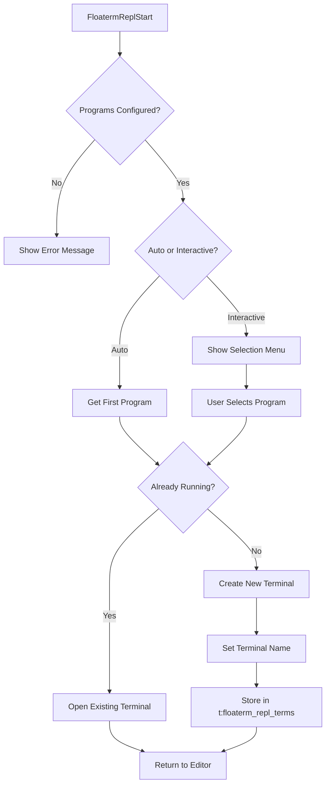
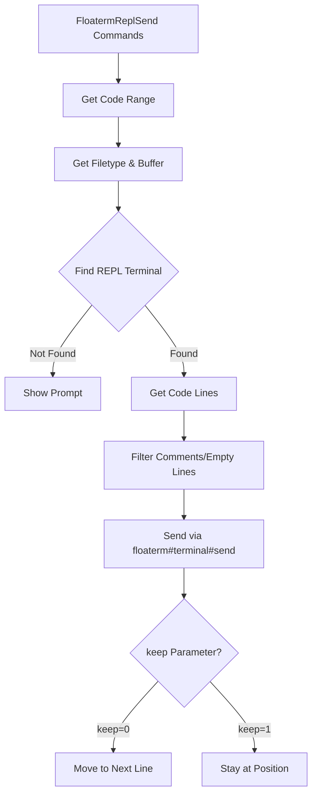
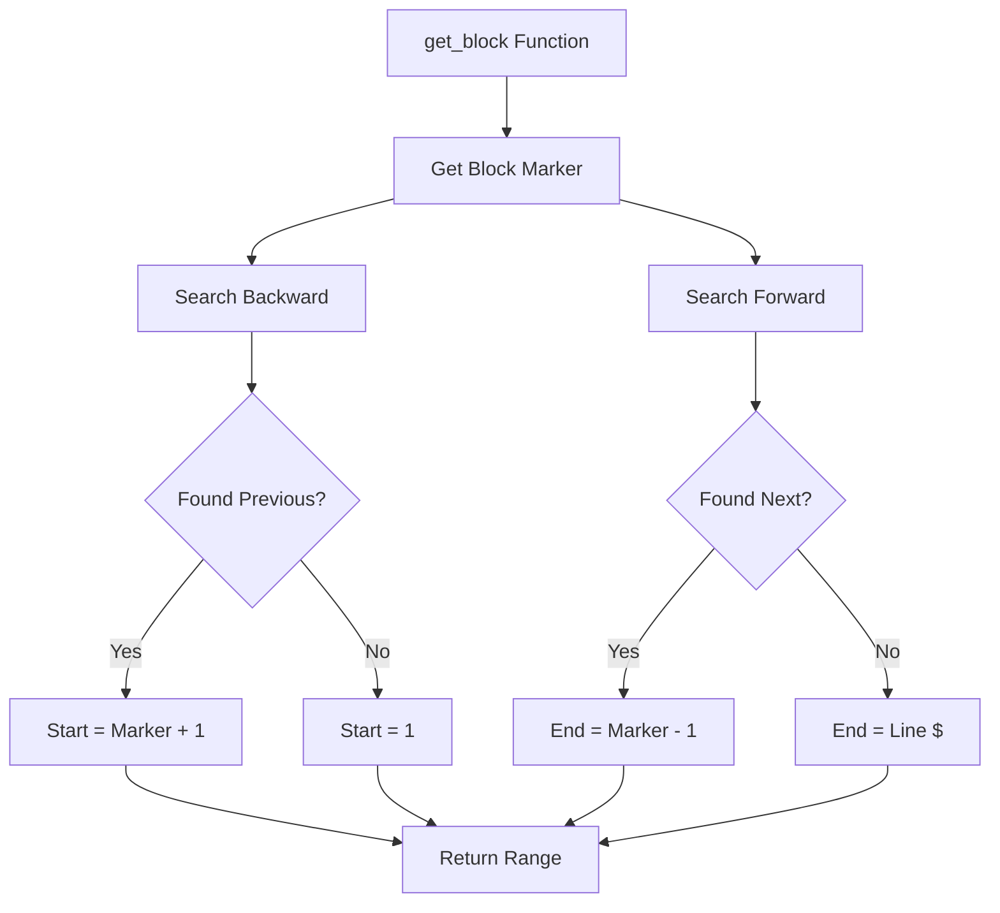
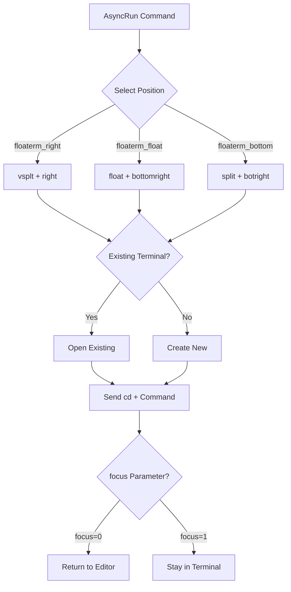

# vim-floaterm-enhance
[中文文档](README_cn.md)

This is a Vim plugin based on [vim-floaterm](https://github.com/voldikss/vim-floaterm) for enhancing the floating terminal. It provides two main features:

1. **REPL Integration**: Send code from your editor to a REPL in a floating terminal
2. **AsyncRun Integration**: Run programs in floating terminals through asyncrun.vim

## Architecture Overview

### 1. REPL Startup Flow



**Key Variables:**
- `g:floaterm_repl_programs`: Global dictionary mapping filetypes to REPL programs
  ```vim
  " Example: {'python': ['ipython', 'python3'], 'r': ['radian']}
  ```
- `t:floaterm_repl_terms`: Tab-level dictionary storing terminal mappings
  - **Key**: `"{filetype}{bufnr}"` (e.g., `"python12"`)
  - **Value**: Terminal name (e.g., `"#12|python!IPYTHON"`)
- `b:floaterm_repl_curr_bufnr`: Buffer-level variable storing current buffer number
- Terminal name format: `"#{bufnr}|{filetype}!{PROGRAM}"`
  - Example: `"#12|python!IPYTHON"` for buffer 12, Python filetype, using IPython

### 2. Code Sending Flow



**Key Variables:**
- `&filetype`: Current buffer's filetype (e.g., `"python"`, `"javascript"`)
- `a:keep`: Boolean parameter controlling cursor movement
  - `0`: Move cursor to next non-empty/non-comment line after sending
  - `1`: Keep cursor at current position
- `g:floaterm_repl_block_mark`: Dictionary defining code block markers
  ```vim
  " Example: {'python': '# %%', 'javascript': '%%'}
  ```
- `a:line_begin`, `a:line_end`: Range of lines to send
- `a:vmode`: Visual mode flag (1 if called from visual selection)

### 3. Code Block Detection



**Key Variables:**
- `g:floaterm_repl_block_mark`: Dictionary or list defining block markers
  ```vim
  " Single marker: {'python': '# %%'}
  " Multiple markers: {'python': ['# %%', '## Cell', '# ---']}
  ```
- `search_str`: Pattern string constructed from markers
  - Single: `"^# %%"`
  - Multiple: `"^# %%\|^## Cell\|^# ---"` (joined with `\|`)
- `line("$")`: Total number of lines in current buffer
- `getline(start, end)`: Get lines from range [start, end]

### 4. AsyncRun Integration



**Key Variables:**
- `a:opts`: Dictionary containing asyncrun options
  - `cmd`: Command to execute
  - `width`: Terminal width (optional)
  - `height`: Terminal height (optional)
  - `silent`: Hide terminal after creation (1) or keep visible (0)
  - `focus`: Return to editor (0) or stay in terminal (1)
- `floaterm_wintype`: Window type - `'float'`, `'vsplit'`, or `'split'`
- `position`: Window position - `'right'`, `'bottomright'`, `'botright'`, etc.
- `floaterm_bufnr`: Buffer number of the floaterm terminal
- `g:has_popup_floating`: Global flag checking Vim/Neovim version for floating window support

### Key Components Summary

| Component | Variable/Function | Type | Description |
|-----------|-------------------|------|-------------|
| **Terminal Management** | `t:floaterm_repl_terms` | Tab-level dict | Maps `{filetype}{bufnr}` → terminal name |
| **Terminal Name** | Terminal name format | String | `#{bufnr}\|{filetype}!{PROGRAM}` |
| **Buffer Tracking** | `b:floaterm_repl_curr_bufnr` | Buffer-level | Current buffer number for REPL |
| **REPL Programs** | `g:floaterm_repl_programs` | Global dict | Filetype → list of REPL commands |
| **Block Markers** | `g:floaterm_repl_block_mark` | Global dict/list | Filetype → marker pattern(s) |
| **Clear Commands** | `g:floaterm_repl_clear` | Global dict | Filetype → clear command |
| **Exit Commands** | `g:floaterm_repl_exit` | Global dict | Filetype → exit command |
| **Position** | `g:floaterm_repl_open_position` | Global string | `'auto'`, `'right'`, or `'bottom'` |
| **Ratio** | `g:floaterm_repl_ratio` | Global float | Terminal size ratio (default: 0.38) |

**Code Locations:**
- REPL startup: `autoload/floaterm/repl.vim:99-158`
- Code sending: `autoload/floaterm/repl.vim:353-394`
- Block detection: `autoload/floaterm/enhance.vim:35-63`
- AsyncRun integration: `autoload/floaterm/asyncrun.vim:2-57`


# Requirements
- Vim or Neovim with the `:terminal` command. The specific version requirement is higher than [vim-floaterm](https://github.com/voldikss/vim-floaterm).
- Install the corresponding `repl` program, such as `ipython`, `radian`.
- Install [asyncrun.vim](https://github.com/skywind3000/asyncrun.vim).
- Related runner programs: `python`, `R`, `rustc`... etc

# REPL Integration

The following sections describe the REPL functionality of this plugin.

## Principle

The main function of this plugin is to allow users to send code snippets from the Vim/Neovim editor to a started REPL program for execution and display the results in a floating terminal. Its core principles include:

- **Meaning of the exclamation mark (!)**: When an exclamation mark is added after a command, it means that after sending the code, the cursor will remain at its current position
- **REPL Program Management:**  Store REPL startup commands associated with different file types through the global variable `g:floaterm_repl_programs`. For example, the Python file type is associated with the `ipython` or `python3` command.
- **Code Block Marking:** Allow users to define code blocks using specific markers in the code (e.g., `# %%` in Python). The plugin recognizes these markers, making it convenient for users to send code block by block.
- **Clear and Exit Commands:** Define clear and exit commands for REPLs of different programming languages, such as `.clear` and `.exit` for JavaScript.
- **Floating Terminal Interaction:** Rely on the `vim-floaterm` plugin to create and manage floating terminals and start the REPL program in them. The plugin sends code and commands through the interface provided by `vim-floaterm`. `t:floaterm_repl_termnames` is a tab-level variable used to store the mapping between the index of the file type and buffer number combination and the floating terminal name, which is convenient for subsequent searching and operating the corresponding floating terminal.
- **Code Sending Process:** When the user executes a command to send code, the plugin obtains the selected code range (current line, selected lines, code block, etc.) and then sends it to the REPL process associated with the current file type.
- **Dynamic Adjustment of Floaterm Position:** The position of the floaterm window (right or bottom) is adjusted according to the screen's column/row ratio.

## Commands

The following are the main commands and functions provided by the `vim-floaterm-repl` plugin:

* **`FloatermReplStart`**: Start the REPL program for the current file type. If multiple executable REPL programs are configured, a list will pop up for the user to select.
* **`FloatermReplSend [range]`**: Send the code in the specified range to the REPL.
    * You can use line number ranges, such as `:10,20FloatermReplSend` to send lines 10 to 20.
    * If no range is specified, the current line is sent.
* **`FloatermReplSendVisual`**: Send the code selected in visual mode to the REPL.
* **`FloatermReplSendBlock`**: Send the current code block to the REPL. The code block is separated by the marker defined by `g:floaterm_repl_block_mark`. The default marker is `# %%`.
* **`FloatermReplSendFromBegin`**: Send from the beginning of the file to the current line (or the previous code block marker).
* **`FloatermReplSendToEnd`**: Send from the current line to the end of the file.
* **`FloatermReplSendAll`**: Send the entire file content to the REPL.
* **`FloatermReplSendCrOrStart`**:
    * If the REPL is not started, start the REPL.
    * If the REPL is started, send a newline character to the REPL.
* **`FloatermReplSendClear`**: Send the clear screen command to the REPL to clear the display of the REPL terminal.
* **`FloatermReplSendExit`**: Send the exit command to the REPL to close the REPL process.
* **`FloatermReplSendWord`**: Send the word under the cursor to the REPL.
* **`FloatermReplMark [range]`**: Visually mark a code block or selection for easy sending later.
* **`FloatermReplSendMark`**: Send the code marked previously using the `FloatermReplMark` command.
* **`FloatermReplQuickuiMark`**: (May depend on the `vim-quickui` plugin) Quickly view the marked code.

Internal function note:

* **`floaterm#repl#send(border, stay_curr, [line1], [line2])`**: Unified send entry; `border` supports `block`, `begin`, `end`, `all`, and `line` (current line/visual range).

## Configuration

You can customize the behavior of the plugin by configuring Vim global variables:

* **`g:floaterm_repl_programs`**: A dictionary for configuring REPL startup commands associated with different file types.
* **`g:floaterm_repl_block_mark`**: A dictionary for configuring code block markers for different file types.
* **`g:floaterm_repl_clear`**: A dictionary for configuring REPL clear screen commands for different file types.
* **`g:floaterm_repl_exit`**: A dictionary for configuring REPL exit commands for different file types.


## Typical Keymaps

> Use `<M-e>` as the prefix for operations, please note `!`.
```
" start
nnoremap <silent><M-e>r :FloatermReplStart!<Cr>
nnoremap <silent><M-e><Cr> :FloatermReplSendCrOrStart<Cr>
" basic send
nnoremap <silent><M-e>n :FloatermReplSend<Cr>
nnoremap <silent><M-e>l :FloatermReplSend!<Cr>
xnoremap <silent><M-e>n :FloatermReplSendVisual<Cr>
xnoremap <silent><M-e>l :FloatermReplSendVisual!<Cr>
nnoremap <silent><M-e>q :FloatermReplSendExit<Cr>
" block send
xnoremap <silent><M-e><M-e>   :FloatermReplSendVisual<Cr>
xnoremap <silent><M-e><Space> :FloatermReplSendVisual!<Cr>
nnoremap <silent><M-e><M-e>   :FloatermReplSendBlock<Cr>
nnoremap <silent><M-e><Space> :FloatermReplSendBlock!<Cr>
" send above/below/all lines
nnoremap <silent><M-e>b :FloatermReplSendFromBegin!<Cr>
nnoremap <silent><M-e>e :FloatermReplSendToEnd!<Cr>
nnoremap <silent><M-e>a :FloatermReplSendAll!<Cr>
" send word
nnoremap <silent><M-e>k :FloatermReplSendWord<Cr>
xnoremap <silent><M-e>k :FloatermReplSendWord!<Cr>
" mark print send
nnoremap <silent><M-e><M-m> :FloatermReplMark<Cr>
xnoremap <silent><M-e><M-m> :FloatermReplMark!<Cr>
nnoremap <silent><M-e><M-l> :FloatermReplSendMark<Cr>
nnoremap <silent><M-e><M-r> :FloatermReplQuickuiMark<Cr>
" clear
nnoremap <silent><M-e><M-c> :FloatermReplSendClear<Cr>
```

# AsyncRun.vim Integration

In addition to the REPL functionality, this plugin provides integration with [asyncrun.vim](https://github.com/skywind3000/asyncrun.vim) to run programs in floating terminals.

## Features

The following runners are registered automatically:

* **`floaterm_right`**: Run commands in a vertical split terminal on the right side
* **`floaterm_float`**: Run commands in a floating terminal window
* **`floaterm_bottom`**: Run commands in a horizontal split terminal at the bottom
W

## Usage Examples

```vim
" Run a simple command in a floating terminal
:AsyncRun -mode=term -pos=floaterm_float echo "Hello, World!"

" Run a Python script in a right-side terminal
:AsyncRun -mode=term -pos=floaterm_right python %

" Run a Node.js script in a bottom terminal
:AsyncRun -mode=term -pos=floaterm_bottom node %
```
