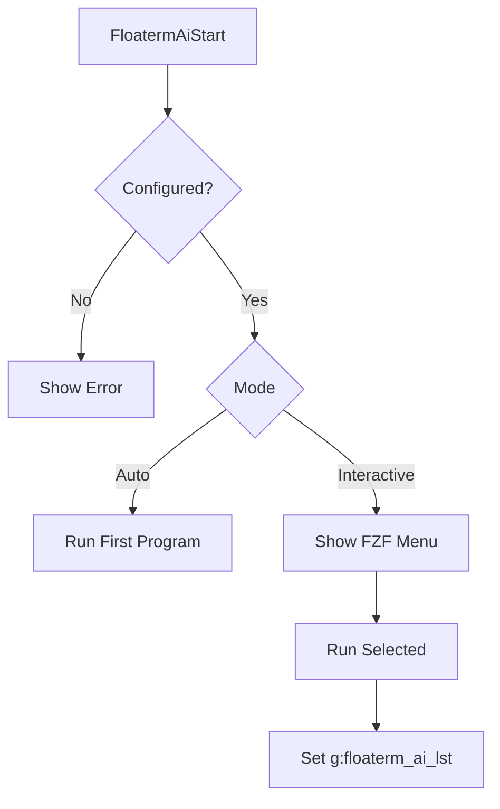
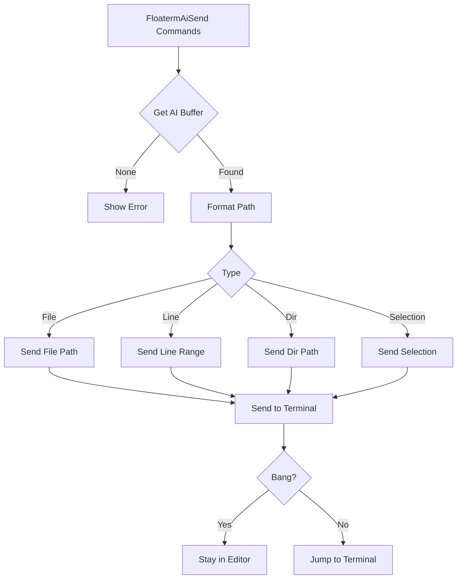
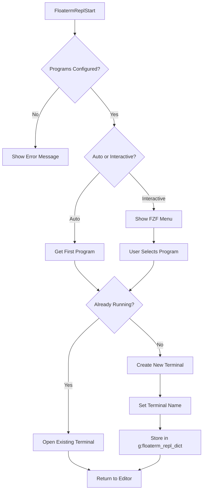
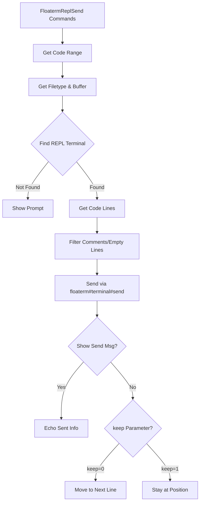
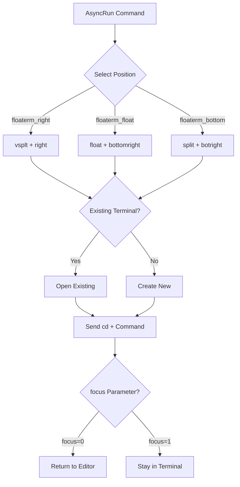

# vim-floaterm-enhance

[中文文档](README_cn.md)

This is a Vim plugin based on [vim-floaterm](https://github.com/voldikss/vim-floaterm) for enhancing the floating terminal. It provides features for **AI interaction**, **REPL integration**, and **AsyncRun support**.

## Architecture Overview

### 1. AI Startup Flow



### 2. AI Context Sending Flow



### 3. REPL Startup Flow



### 4. REPL Code Sending Flow



### 5. AsyncRun Integration



# AI Integration

This module allows you to send context (files, lines, directories) to an AI tool running in a floating terminal. It's designed to work with CLI-based AI tools (like `claude`, `codex`, `opencode`, etc.) that accept input or context arguments.

## AI Commands

| Mode | Command | Action |
| :--- | :--- | :--- |
| **Startup Control** |
| n | `:FloatermAiStart` | Start AI (Interactive selection) |
| n | `:FloatermAiStart!` | Start default AI (Execute immediately) |
| n | `:FloatermAiSendCr` | Send Enter key to AI terminal |
| **Send Context** |
| n/v | `:FloatermAiSendLineRange` | Send current line/selection, jump to AI terminal |
| n/v | `:FloatermAiSendLineRange!` | Send current line/selection, stay in current buffer |
| n | `:FloatermAiSendFile` | Send current file path, jump to AI terminal |
| n | `:FloatermAiSendFile!` | Send current file path, stay in current buffer |
| n | `:FloatermAiSendDir` | Send current directory path, jump to AI terminal |
| n | `:FloatermAiSendDir!` | Send current directory path, stay in current buffer |
| n | `:FloatermAiFzfFiles` | Select files via FZF to send, jump to AI terminal |
| n | `:FloatermAiFzfFiles!` | Select files via FZF to send, stay in current buffer |

> **Note**:
> - Commands with `!` suffix will **keep** focus in the current editor window
> - Commands without `!` will **jump** to the AI terminal window
> - Mode: `n` = normal mode, `v` = visual mode

---

# REPL Integration

This module allows you to send code snippets from your editor to a REPL (Read-Eval-Print Loop) running in a floating terminal.

## REPL Commands

| Mode | Command | Action |
| :--- | :--- | :--- |
| **Startup Control** |
| n | `:FloatermReplStart` | Start REPL (Interactive selection) |
| n | `:FloatermReplStart!` | Start default REPL (Execute immediately) |
| n | `:FloatermReplSendCrOrStart!` | Send Enter key or start REPL (Stay in editor) |
| n | `:FloatermReplSendExit` | Send exit command to REPL |
| n | `:FloatermReplSendClear` | Send clear screen command to REPL |
| **Send Code** |
| n/v | `:FloatermReplSend` | Send current line/selection, move cursor to next line |
| n/v | `:FloatermReplSend!` | Send current line/selection, keep cursor at current position |
| n/v | `:FloatermReplSendBlock` | Send code block (marked by `%%`), move cursor to next line |
| n/v | `:FloatermReplSendBlock!` | Send code block (marked by `%%`), keep cursor at current position |
| n | `:FloatermReplSendToEnd!` | Send from current line to end of file, keep cursor position |
| n | `:FloatermReplSendFromBegin!` | Send from beginning of file to current line, keep cursor position |
| n | `:FloatermReplSendAll!` | Send entire file content, keep cursor position |
| n/v | `:FloatermReplSendWord` | Send word under cursor or selection |
| **Mark Features** |
| n/v | `:FloatermReplMark` | Mark current selection for later sending |
| n | `:FloatermReplSendMark` | Send previously marked code |
| n | `:FloatermReplShowMark` | Show previously marked code content |

> **Note**:
> - Commands with `!` suffix will **keep** cursor at current position
> - Commands without `!` will **move** cursor to next line (for continuous execution)
> - Mode: `n` = normal mode, `v` = visual mode

---

# AsyncRun Integration

In addition to REPL and AI functionality, this plugin provides integration with [asyncrun.vim](https://github.com/skywind3000/asyncrun.vim) to run programs in floating terminals.

## Features

The following runners are registered automatically:

* **`floaterm_right`**: Run commands in a vertical split terminal on the right side
* **`floaterm_float`**: Run commands in a floating terminal window
* **`floaterm_bottom`**: Run commands in a horizontal split terminal at the bottom

## Usage Examples

```vim
" Run a simple command in a floating terminal
:AsyncRun -mode=term -pos=floaterm_float echo "Hello, World!"

" Run a Python script in a right-side terminal
:AsyncRun -mode=term -pos=floaterm_right python %

" Run a Node.js script in a bottom terminal
:AsyncRun -mode=term -pos=floaterm_bottom node %
```

# Core Architecture Variables

| Component | Variable/Function | Type | Description |
|-----------|-------------------|------|-------------|
| **AI Buffer List** | `g:floaterm_ai_lst` | Global List | Stores buffer numbers of AI terminals |
| **AI Programs** | `g:floaterm_ai_programs` | Global Dict | List of AI commands |
| **REPL Map** | `g:floaterm_repl_dict` | Global Dict | Maps `{filetype}-{bufnr}` → REPL bufnr |
| **REPL Programs** | `g:floaterm_repl_programs` | Global Dict | Filetype → list of REPL commands |
| **Layout Ratio** | `g:floaterm_prog_split_ratio` | Global Float | Split window ratio (default 0.38) |
| **Float Ratio** | `g:floaterm_prog_float_ratio` | Global Float | Float window ratio (default 0.45) |
| **Col/Row Ratio**| `g:floaterm_prog_col_row_ratio`| Global Float | Threshold to switch bottom/right (def 2.5) |

# Requirements

## Base Environment
- Vim or Neovim with the `:terminal` command.
- Install [asyncrun.vim](https://github.com/skywind3000/asyncrun.vim)
- Install [fzf.vim](https://github.com/junegunn/fzf.vim) (for interactive selection features)

## AI Features
- Install CLI-based AI tools that support input/context arguments, such as:
  - `claude` - Claude AI command-line tool
  - `codex` - OpenAI Codex command-line tool
  - `opencode` - Open source code assistant tool

## REPL Features
- Install corresponding REPL programs, such as:
  - Python: `ipython`, `python`
  - R: `radian`, `R`
  - Node.js: `node`
  - Other language interactive interpreters

## AsyncRun Features
- Related runner programs: `python`, `R`, `rustc`, `node`, `go`, etc.
