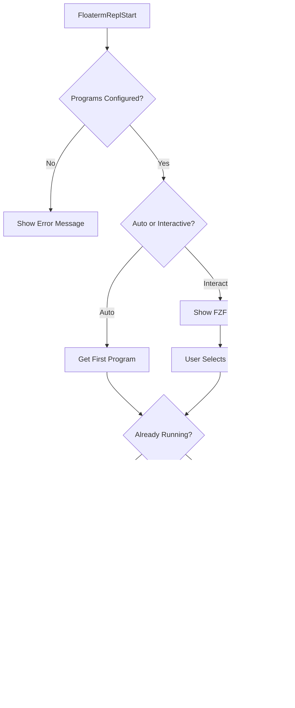

# vim-floaterm-enhance

[中文文档](README_cn.md)

This is a Vim plugin based on [vim-floaterm](https://github.com/voldikss/vim-floaterm) for enhancing the floating terminal. It provides features for **AI interaction**, **REPL integration**, and **AsyncRun support**.

## Architecture Overview

### 1. AI Interaction Flow

```mermaid
graph TB
    subgraph Startup
    Start[FloatermAiStart] --> Check{Configured?}
    Check -->|No| Error[Show Error]
    Check -->|Yes| Select{Mode}
    Select -->|Auto| RunFirst[Run First Program]
    Select -->|Interactive| FZF[Show FZF Menu]
    FZF --> Run[Run Selected]
    Run --> SetBuf[Set g:floaterm_ai_lst]
    end

    subgraph Sending Context
    Send[FloatermAiSend...] --> GetBuf{Get AI Buffer}
    GetBuf -->|None| Err2[Show Error]
    GetBuf -->|Found| Format[Format Path with @]
    Format --> Type{Type}
    Type -->|File| SendFile[Send @/path/to/file]
    Type -->|Line| SendRange[Send @/path/to/file:10-20]
    Type -->|Dir| SendDir[Send @/path/to/dir]
    Type -->|Selection| SendSel[Send @/path/to/file:5-10]
    SendFile --> Term[Send to Terminal]
    SendRange --> Term
    SendDir --> Term
    SendSel --> Term
    Term --> Stay{Bang (!)?}
    Stay -->|Yes| StayEd[Stay in Editor]
    Stay -->|No| JumpTerm[Jump to Terminal]
    end
```

### 2. REPL Startup Flow



### 3. REPL Code Sending Flow


### 4. AsyncRun Integration


# AI Integration

This module allows you to send context (files, lines, directories) to an AI tool running in a floating terminal. It's designed to work with CLI-based AI tools (like `mods`, `aichat`, `sgpt`, etc.) that accept input or context arguments.

## AI Commands

| Command | Action |
| :--- | :--- |
| `FloatermAiStart` | Start AI program (interactive selection) |
| `FloatermAiStart!` | Start default AI program immediately |
| `FloatermAiSendLineRange` | Send current line or selection as context |
| `FloatermAiSendFile` | Send current file path as context |
| `FloatermAiSendDir` | Send current directory path as context |
| `FloatermAiFzfFiles` | Select multiple files via FZF to send as context |
| `FloatermAiSendCr` | Send "Enter" key to AI terminal |

> **Note**: Commands ending with `!` (e.g., `FloatermAiSendFile!`) will keep focus in the current buffer after sending. Without `!`, focus moves to the AI terminal.

## AI Keymaps
> **Prefix**: `<Alt-e>` (`<M-e>`)
> **Source**: `conf.d/main/plugin/ai.vim`
> **Note**: These keymaps are **examples** reflecting the author's personal preference. Feel free to customize them in your own config.

| Key | Mode | Command | Action |
| :--- | :--- | :--- | :--- |
| **Control** |
| `<M-e><M-e>` | n/i/v/t | (Map) | Switch focus between Editor and AI Window |
| `<M-e><M-r>` | n | `:FloatermAiStart` | Start AI (Interactive) |
| `<M-e>r` | n | `:FloatermAiStart!` | Start Default AI |
| `<M-e><Cr>` | n | `:FloatermAiSendCr` | Send Enter |
| **Context Sending** |
| `<M-e>l` | n/v | `:FloatermAiSendLineRange` | Send **L**ine/Selection |
| `<M-e><BS>` | n/v | `:FloatermAiSendLineRange!` | Send Line/Selection (Stay in buffer) |
| `<M-e>f` | n | `:FloatermAiSendFile` | Send **F**ile content |
| `<M-e>=` | n | `:FloatermAiSendFile!` | Send File content (Stay in buffer) |
| `<M-e>d` | n | `:FloatermAiSendDir` | Send **D**irectory file list |
| `<M-e>-` | n | `:FloatermAiSendDir!` | Send Directory list (Stay in buffer) |
| `<M-e>i` | n | `:FloatermAiFzfFiles` | Select files via FZF to send |
| `<M-e>0` | n | `:FloatermAiFzfFiles!` | Select files via FZF (Stay in buffer) |

## AI Configuration Example

```vim
" Switch window
nnoremap <M-e><M-e> <C-w><C-w>

" Start
nnoremap <silent><M-e><M-r> :FloatermAiStart<Cr>
nnoremap <silent><M-e>r :FloatermAiStart!<Cr>
nnoremap <silent><M-e><Cr> :FloatermAiSendCr<Cr>

" Send Context
nnoremap <silent><M-e>l    :FloatermAiSendLineRange<Cr>
nnoremap <silent><M-e><BS> :FloatermAiSendLineRange!<Cr>
nnoremap <silent><M-e>f    :FloatermAiSendFile<Cr>
nnoremap <silent><M-e>=    :FloatermAiSendFile!<Cr>
nnoremap <silent><M-e>d    :FloatermAiSendDir<Cr>
nnoremap <silent><M-e>-    :FloatermAiSendDir!<Cr>
nnoremap <silent><M-e>i    :FloatermAiFzfFiles<Cr>
nnoremap <silent><M-e>0    :FloatermAiFzfFiles!<Cr>
```

---

# REPL Integration

This module allows you to send code snippets from your editor to a REPL (Read-Eval-Print Loop) running in a floating terminal.

## REPL Commands

| Command | Action |
| :--- | :--- |
| `FloatermReplStart` | Start REPL program |
| `FloatermReplSend` | Send current line or range |
| `FloatermReplSendBlock` | Send current block (marked by `%%`) |
| `FloatermReplSendVisual` | Send visual selection |
| `FloatermReplSendAll` | Send entire file |
| `FloatermReplSendExit` | Send exit command |
| `FloatermReplSendClear` | Send clear command |

## REPL Keymaps
> **Prefix**: `<Alt-i>` (`<M-i>`)
> **Source**: `conf.d/main/plugin/debug.vim`
> **Note**: These keymaps are **examples** reflecting the author's personal preference. Feel free to customize them in your own config.

| Key | Mode | Command | Action |
| :--- | :--- | :--- | :--- |
| **Window & Control** |
| `<M-i><M-i>` | n/i/v/t | (Map) | Switch focus between Editor and REPL Window |
| `<M-i><M-r>` | n | `:FloatermReplStart` | **Start** REPL (Interactive Selection) |
| `<M-i>r` | n | `:FloatermReplStart!` | Start Default REPL immediately |
| `<M-i><Cr>` | n | `:FloatermReplSendCrOrStart!` | Send **Enter** or Start REPL |
| `<M-i>q` | n | `:FloatermReplSendExit` | Send **Quit**/Exit command |
| `<M-i>L` | n | `:FloatermReplSendClear` | Clear REPL screen |
| **Send Code** |
| `<M-i>n` | n/v | `:FloatermReplSend` | Send Line/Selection (Move to **N**ext) |
| `<M-i>l` | n/v | `:FloatermReplSend!` | Send **L**ine/Selection (Stay) |
| `<M-i><M-e>`| n/v | `:FloatermReplSendBlock` | Send **Block** / Visual (Move Next) |
| `<M-i>e` | n | `:FloatermReplSendToEnd!` | Send to **E**nd of file |
| `<M-i>b` | n | `:FloatermReplSendFromBegin!` | Send from **B**eginning |
| `<M-i>a` | n | `:FloatermReplSendAll!` | Send **A**ll content |
| `<M-i>k` | n/v | `:FloatermReplSendWord` | Send **K**eyword (Word under cursor) |
| **Marks** |
| `<M-i>m` | n/v | `:FloatermReplMark` | **M**ark Selection |
| `<M-i>s` | n | `:FloatermReplSendMark` | **S**end Marked Code |
| `<M-i>S` | n | `:FloatermReplShowMark` | **S**how Marked Code |

## REPL Configuration Example

```vim
" Switch window
nnoremap <M-i><M-i> <C-w><C-w>
inoremap <M-i><M-i> <ESC><C-w><C-w>
xnoremap <M-i><M-i> <ESC><C-w><C-w>
tnoremap <M-i><M-i> <C-\><C-n><C-w><C-w>

" Start
nnoremap <silent><M-i><M-r> :FloatermReplStart<Cr>
nnoremap <silent><M-i>r :FloatermReplStart!<Cr>
nnoremap <silent><M-i><Cr> :FloatermReplSendCrOrStart!<Cr>

" Send
nnoremap <silent><M-i>n :FloatermReplSend<Cr>
nnoremap <silent><M-i>l :FloatermReplSend!<Cr>
xnoremap <silent><M-i>n :FloatermReplSend<Cr>
xnoremap <silent><M-i>l :FloatermReplSend!<Cr>

" Block & Scope
nnoremap <silent><M-i><M-e> :FloatermReplSendBlock<Cr>
nnoremap <silent><M-i>e :FloatermReplSendToEnd!<Cr> " Note: Overrides Block!
nnoremap <silent><M-i>b :FloatermReplSendFromBegin!<Cr>
nnoremap <silent><M-i>a :FloatermReplSendAll!<Cr>

" Misc
nnoremap <silent><M-i>q :FloatermReplSendExit<Cr>
nnoremap <silent><M-i>L :FloatermReplSendClear<Cr>
nnoremap <silent><M-i>k :FloatermReplSendWord<Cr>
```

---

# AsyncRun Integration

In addition to REPL and AI functionality, this plugin provides integration with [asyncrun.vim](https://github.com/skywind3000/asyncrun.vim) to run programs in floating terminals.

## Features

The following runners are registered automatically:

* **`floaterm_right`**: Run commands in a vertical split terminal on the right side
* **`floaterm_float`**: Run commands in a floating terminal window
* **`floaterm_bottom`**: Run commands in a horizontal split terminal at the bottom

## Usage Examples

```vim
" Run a simple command in a floating terminal
:AsyncRun -mode=term -pos=floaterm_float echo "Hello, World!"

" Run a Python script in a right-side terminal
:AsyncRun -mode=term -pos=floaterm_right python %

" Run a Node.js script in a bottom terminal
:AsyncRun -mode=term -pos=floaterm_bottom node %
```

# Core Architecture Variables

| Component | Variable/Function | Type | Description |
|-----------|-------------------|------|-------------|
| **AI Buffer List** | `g:floaterm_ai_lst` | Global List | Stores buffer numbers of AI terminals |
| **REPL Map** | `g:floaterm_repl_dict` | Global Dict | Maps `{filetype}-{bufnr}` → REPL bufnr |
| **REPL Programs** | `g:floaterm_repl_programs` | Global Dict | Filetype → list of REPL commands |
| **AI Programs** | `g:floaterm_ai_programs` | Global Dict | List of AI commands |
| **Layout Ratio** | `g:floaterm_prog_split_ratio` | Global Float | Split window ratio (default 0.38) |
| **Float Ratio** | `g:floaterm_prog_float_ratio` | Global Float | Float window ratio (default 0.45) |
| **Col/Row Ratio**| `g:floaterm_prog_col_row_ratio`| Global Float | Threshold to switch bottom/right (def 2.5) |

# Requirements
- Vim or Neovim with the `:terminal` command. The specific version requirement is higher than [vim-floaterm](https://github.com/voldikss/vim-floaterm).
- Install the corresponding `repl` program, such as `ipython`, `radian`.
- Install [asyncrun.vim](https://github.com/skywind3000/asyncrun.vim).
- Related runner programs: `python`, `R`, `rustc`... etc
