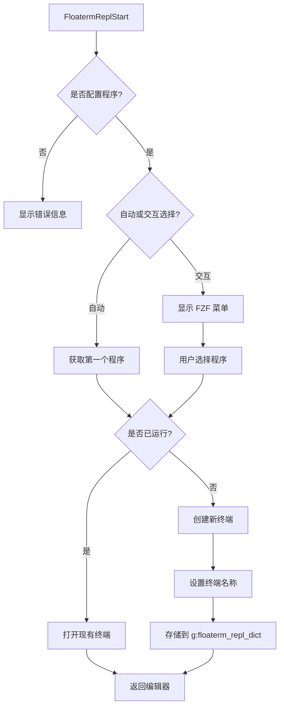
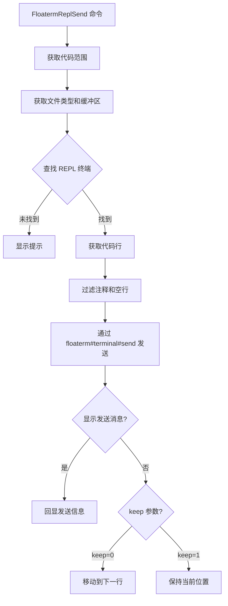
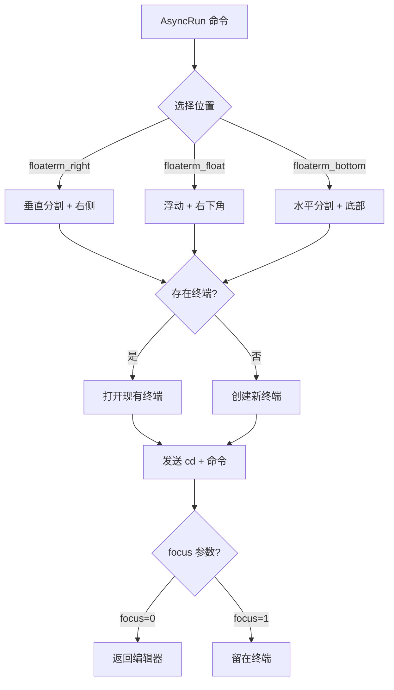

# vim-floaterm-enhance

[English Document](README.md)

这是一个基于 [vim-floaterm](https://github.com/voldikss/vim-floaterm) 的 Vim 插件，用于增强浮动终端的功能。本插件提供 AI 交互、REPL 集成以及 AsyncRun 支持等主要功能。

# AI 集成 (AI Integration)

该模块允许你将上下文（文件、代码行、目录）发送到运行在浮动终端中的 AI 工具。它旨在与接受输入或上下文参数的 CLI AI 工具（如 `mods`, `aichat`, `sgpt` 等）配合使用。

## AI 流程概览

```mermaid
graph TB
    subgraph 启动流程
    Start[FloatermAiStart] --> Check{已配置?}
    Check -->|否| Error[显示错误]
    Check -->|是| Select{模式}
    Select -->|自动| RunFirst[运行首个程序]
    Select -->|交互| FZF[显示 FZF 菜单]
    FZF --> Run[运行选中程序]
    Run --> SetBuf[设置 g:floaterm_ai_lst]
    end

    subgraph 发送上下文
    Send[FloatermAiSend...] --> GetBuf{获取 AI 缓冲区}
    GetBuf -->|无| Err2[显示错误]
    GetBuf -->|找到| Format[格式化路径 (加 @)]
    Format --> Type{类型}
    Type -->|File| SendFile[发送 @/path/to/file]
    Type -->|Line| SendRange[发送 @/path/to/file:10-20]
    Type -->|Dir| SendDir[发送 @/path/to/dir]
    Type -->|Selection| SendSel[发送 @/path/to/file:5-10]
    SendFile --> Term[发送到终端]
    SendRange --> Term
    SendDir --> Term
    SendSel --> Term
    Term --> Stay{Bang (!)?}
    Stay -->|是| StayEd[留在编辑器]
    Stay -->|否| JumpTerm[跳转到终端]
    end
```

## AI 命令

| 命令 | 描述 |
| :--- | :--- |
| `FloatermAiStart` | 启动 AI 程序 (交互式选择) |
| `FloatermAiStart!` | 立即启动默认 AI 程序 |
| `FloatermAiSendLineRange` | 发送当前行或选区作为上下文 |
| `FloatermAiSendFile` | 发送当前文件路径作为上下文 |
| `FloatermAiSendDir` | 发送当前目录路径作为上下文 |
| `FloatermAiFzfFiles` | 通过 FZF 选择多个文件作为上下文发送 |
| `FloatermAiSendCr` | 向 AI 终端发送 "Enter" 键 |

> **注意**: 以 `!` 结尾的命令（例如 `FloatermAiSendFile!`）在发送后会**保持**在当前缓冲区。不带 `!` 则会跳转到 AI 终端。

## AI 快捷键
> **前缀**: `<Alt-e>` (`<M-e>`)
> **来源**: `conf.d/main/plugin/ai.vim`
> **注意**: 以下快捷键仅为**示例**，反映了作者的个人偏好。请根据您的习惯进行自定义配置。

| 快捷键 | 模式 | 命令 | 功能描述 |
| :--- | :--- | :--- | :--- |
| **控制** |
| `<M-e><M-e>` | n/i/v/t | (映射) | 在编辑器和 AI 窗口间**切换焦点** |
| `<M-e><M-r>` | n | `:FloatermAiStart` | 启动 AI (交互式) |
| `<M-e>r` | n | `:FloatermAiStart!` | 启动默认 AI |
| `<M-e><Cr>` | n | `:FloatermAiSendCr` | 发送回车 |
| **发送上下文** |
| `<M-e>l` | n/v | `:FloatermAiSendLineRange` | 发送**行**/选区 |
| `<M-e><BS>` | n/v | `:FloatermAiSendLineRange!` | 发送行/选区 (保持在当前缓冲区) |
| `<M-e>f` | n | `:FloatermAiSendFile` | 发送**文件**内容 |
| `<M-e>=` | n | `:FloatermAiSendFile!` | 发送文件内容 (保持在当前缓冲区) |
| `<M-e>d` | n | `:FloatermAiSendDir` | 发送**目录**列表 |
| `<M-e>-` | n | `:FloatermAiSendDir!` | 发送目录列表 (保持在当前缓冲区) |
| `<M-e>i` | n | `:FloatermAiFzfFiles` | 通过 FZF 选择文件发送 |
| `<M-e>0` | n | `:FloatermAiFzfFiles!` | 通过 FZF 选择文件 (保持在当前缓冲区) |

## AI 配置示例

```vim
" 切换窗口
nnoremap <M-e><M-e> <C-w><C-w>

" 启动
nnoremap <silent><M-e><M-r> :FloatermAiStart<Cr>
nnoremap <silent><M-e>r :FloatermAiStart!<Cr>
nnoremap <silent><M-e><Cr> :FloatermAiSendCr<Cr>

" 发送上下文
nnoremap <silent><M-e>l    :FloatermAiSendLineRange<Cr>
nnoremap <silent><M-e><BS> :FloatermAiSendLineRange!<Cr>
nnoremap <silent><M-e>f    :FloatermAiSendFile<Cr>
nnoremap <silent><M-e>=    :FloatermAiSendFile!<Cr>
nnoremap <silent><M-e>d    :FloatermAiSendDir<Cr>
nnoremap <silent><M-e>-    :FloatermAiSendDir!<Cr>
nnoremap <silent><M-e>i    :FloatermAiFzfFiles<Cr>
nnoremap <silent><M-e>0    :FloatermAiFzfFiles!<Cr>
```

---

# REPL 集成 (REPL Integration)

该模块允许你将编辑器中的代码片段发送到运行在浮动终端中的 REPL (交互式解释器) 执行。

## REPL 流程概览

### 1. 启动流程



### 2. 代码发送流程



## REPL 命令

| 命令 | 描述 |
| :--- | :--- |
| `FloatermReplStart` | 启动 REPL 程序 |
| `FloatermReplSend` | 发送当前行或范围 |
| `FloatermReplSendBlock` | 发送当前代码块 (由 `%%` 标记) |
| `FloatermReplSendVisual` | 发送可视选区 |
| `FloatermReplSendAll` | 发送整个文件 |
| `FloatermReplSendExit` | 发送退出命令 |
| `FloatermReplSendClear` | 发送清屏命令 |

## REPL 快捷键
> **前缀**: `<Alt-i>` (`<M-i>`)
> **来源**: `conf.d/main/plugin/debug.vim`
> **注意**: 以下快捷键仅为**示例**，反映了作者的个人偏好。请根据您的习惯进行自定义配置。

| 快捷键 | 模式 | 命令 | 功能描述 |
| :--- | :--- | :--- | :--- |
| **窗口与控制** |
| `<M-i><M-i>` | n/i/v/t | (映射) | 在编辑器和 REPL 窗口间**切换焦点** |
| `<M-i><M-r>` | n | `:FloatermReplStart` | **启动** REPL (交互式选择) |
| `<M-i>r` | n | `:FloatermReplStart!` | 立即启动默认 REPL |
| `<M-i><Cr>` | n | `:FloatermReplSendCrOrStart!` | 发送**回车** 或 启动 REPL |
| `<M-i>q` | n | `:FloatermReplSendExit` | 发送**退出**命令 (Quit) |
| `<M-i>L` | n | `:FloatermReplSendClear` | **清屏** (Clear) |
| **发送代码** |
| `<M-i>n` | n/v | `:FloatermReplSend` | 发送行/选区 (光标**下移** Next) |
| `<M-i>l` | n/v | `:FloatermReplSend!` | 发送行/选区 (光标**不动** Line) |
| `<M-i><M-e>`| n/v | `:FloatermReplSendBlock` | 发送**代码块** / 可视选区 (光标下移) |
| `<M-i>e` | n | `:FloatermReplSendToEnd!` | 发送至文件**末尾** (End) |
| `<M-i>b` | n | `:FloatermReplSendFromBegin!` | 发送从**开始**的内容 (Begin) |
| `<M-i>a` | n | `:FloatermReplSendAll!` | 发送**全部**内容 (All) |
| `<M-i>k` | n/v | `:FloatermReplSendWord` | 发送光标下的**关键词**/单词 |
| **标记功能** |
| `<M-i>m` | n/v | `:FloatermReplMark` | **标记**选区 (Mark) |
| `<M-i>s` | n | `:FloatermReplSendMark` | **发送**已标记代码 (Send) |
| `<M-i>S` | n | `:FloatermReplShowMark` | **显示**已标记代码 (Show) |

## REPL 配置示例

```vim
" 切换窗口
nnoremap <M-i><M-i> <C-w><C-w>
inoremap <M-i><M-i> <ESC><C-w><C-w>
xnoremap <M-i><M-i> <ESC><C-w><C-w>
tnoremap <M-i><M-i> <C-\><C-n><C-w><C-w>

" 启动
nnoremap <silent><M-i><M-r> :FloatermReplStart<Cr>
nnoremap <silent><M-i>r :FloatermReplStart!<Cr>
nnoremap <silent><M-i><Cr> :FloatermReplSendCrOrStart!<Cr>

" 发送
nnoremap <silent><M-i>n :FloatermReplSend<Cr>
nnoremap <silent><M-i>l :FloatermReplSend!<Cr>
xnoremap <silent><M-i>n :FloatermReplSend<Cr>
xnoremap <silent><M-i>l :FloatermReplSend!<Cr>

" 代码块与范围
nnoremap <silent><M-i><M-e> :FloatermReplSendBlock<Cr>
nnoremap <silent><M-i>e :FloatermReplSendToEnd!<Cr> " 注意: 覆盖了 Block!
nnoremap <silent><M-i>b :FloatermReplSendFromBegin!<Cr>
nnoremap <silent><M-i>a :FloatermReplSendAll!<Cr>

" 其他
nnoremap <silent><M-i>q :FloatermReplSendExit<Cr>
nnoremap <silent><M-i>L :FloatermReplSendClear<Cr>
nnoremap <silent><M-i>k :FloatermReplSendWord<Cr>
```

---

# AsyncRun 集成 (AsyncRun Integration)

除了 REPL 和 AI 功能外，本插件还提供了与 [asyncrun.vim](https://github.com/skywind3000/asyncrun.vim) 的集成，可以在浮动终端中运行程序。

## AsyncRun 流程



## 功能特性

以下runner被自动注册：

* **`floaterm_right`**: 在右侧垂直分割终端中运行命令
* **`floaterm_float`**: 在浮动终端窗口中运行命令
* **`floaterm_bottom`**: 在底部水平分割终端中运行命令

## 使用示例

```vim
" 在浮动终端中运行简单命令
:AsyncRun -mode=term -pos=floaterm_float echo "Hello, World!"

" 在右侧终端中运行 Python 脚本
:AsyncRun -mode=term -pos=floaterm_right python %

" 在底部终端中运行 Node.js 脚本
:AsyncRun -mode=term -pos=floaterm_bottom node %
```

# 核心架构变量

| 组件 | 变量/函数 | 类型 | 说明 |
|------|----------|------|------|
| **AI 缓冲区列表** | `g:floaterm_ai_lst` | 全局列表 | 存储 AI 终端的缓冲区号 |
| **REPL 映射** | `g:floaterm_repl_dict` | 全局字典 | 映射 `{filetype}-{bufnr}` → 终端 bufnr |
| **REPL 程序** | `g:floaterm_repl_programs` | 全局字典 | 文件类型 → REPL 命令列表 |
| **AI 程序** | `g:floaterm_ai_programs` | 全局字典 | AI 命令列表 |
| **分割比例** | `g:floaterm_prog_split_ratio` | 全局浮点 | 分割窗口比例 (默认: 0.38) |
| **浮动比例** | `g:floaterm_prog_float_ratio` | 全局浮点 | 浮动窗口比例 (默认: 0.45) |
| **位置阈值** | `g:floaterm_prog_col_row_ratio` | 全局浮点 | 自动位置的宽高比阈值 (默认: 2.5) |

# 需求
- 有`:terminal` 命令的 vim或 neovim , 具体版本需求要比[vim-floaterm](https://github.com/voldikss/vim-floaterm)  要高一些
- 安装相应的`repl` 程序，比如`ipython`, `radian`
- 安装 [asyncrun.vim](https://github.com/skywind3000/asyncrun.vim).
- 相关运行程序: `python`, `R`, `rustc` 等
