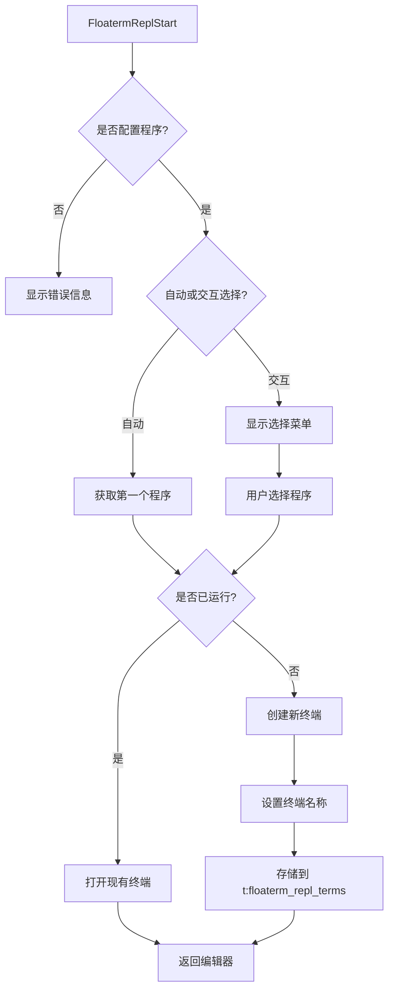
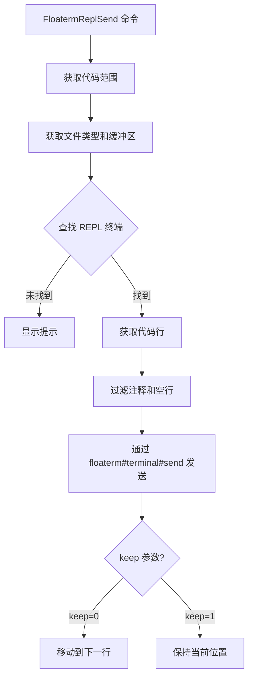
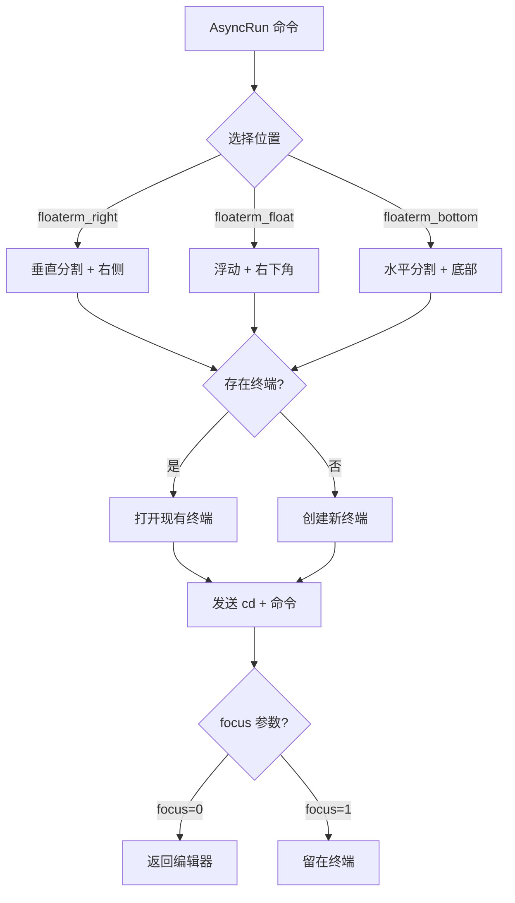

# vim-floaterm-enhance

[English Document](README.md)

这是一个基于 [vim-floaterm](https://github.com/voldikss/vim-floaterm) 的 Vim 插件，用于增强浮动终端的功能。本插件提供两个主要功能：

1. **REPL集成**: 将编辑器中的代码发送到浮动终端中的REPL进行执行
2. **AsyncRun集成**: 通过asyncrun.vim在浮动终端中运行程序

## 架构概览

### 1. REPL 启动流程



**关键变量说明:**
- `g:floaterm_repl_programs`: 全局字典，映射文件类型到 REPL 程序列表
  ```vim
  " 示例: {'python': ['ipython', 'python3'], 'r': ['radian']}
  ```
- `t:floaterm_repl_terms`: Tab 级字典，存储终端映射关系
  - **键**: `"{filetype}{bufnr}"` (例如: `"python12"`)
  - **值**: 终端名称 (例如: `"#12|python!IPYTHON"`)
- `b:floaterm_repl_curr_bufnr`: Buffer 级变量，存储当前缓冲区号
- 终端名称格式: `"#{bufnr}|{filetype}!{PROGRAM}"`
  - 示例: `"#12|python!IPYTHON"` 表示缓冲区 12、Python 文件类型、使用 IPython

### 2. 代码发送流程



**关键变量说明:**
- `&filetype`: 当前缓冲区的文件类型 (例如: `"python"`, `"javascript"`)
- `a:keep`: 布尔参数，控制光标移动行为
  - `0`: 发送后移动光标到下一个非空/非注释行
  - `1`: 保持光标在当前位置
- `g:floaterm_repl_block_mark`: 定义代码块标记的字典
  ```vim
  " 示例: {'python': '# %%', 'javascript': '%%'}
  ```
- `a:line_begin`, `a:line_end`: 要发送的行范围
- `a:vmode`: 可视模式标志 (如果从可视选择调用则为 1)

### 3. 代码块识别


**关键变量说明:**
- `g:floaterm_repl_block_mark`: 字典或列表，定义块标记
  ```vim
  " 单个标记: {'python': '# %%'}
  " 多个标记: {'python': ['# %%', '## Cell', '# ---']}
  ```
- `search_str`: 从标记构造的搜索模式字符串
  - 单个: `"^# %%"`
  - 多个: `"^# %%\|^## Cell\|^# ---"` (用 `\|` 连接)
- `line("$")`: 当前缓冲区的总行数
- `getline(start, end)`: 获取范围 [start, end] 内的行

### 4. AsyncRun 集成



**关键变量说明:**
- `a:opts`: 包含 asyncrun 选项的字典
  - `cmd`: 要执行的命令
  - `width`: 终端宽度 (可选)
  - `height`: 终端高度 (可选)
  - `silent`: 创建后隐藏终端 (1) 或保持可见 (0)
  - `focus`: 返回编辑器 (0) 或留在终端 (1)
- `floaterm_wintype`: 窗口类型 - `'float'`, `'vsplit'`, 或 `'split'`
- `position`: 窗口位置 - `'right'`, `'bottomright'`, `'botright'` 等
- `floaterm_bufnr`: floaterm 终端的缓冲区号
- `g:has_popup_floating`: 全局标志，检查 Vim/Neovim 版本是否支持浮动窗口

### 核心组件汇总

| 组件 | 变量/函数 | 类型 | 说明 |
|------|----------|------|------|
| **终端管理** | `t:floaterm_repl_terms` | Tab 级字典 | 映射 `{filetype}{bufnr}` → 终端名称 |
| **终端名称** | 终端名称格式 | 字符串 | `#{bufnr}\|{filetype}!{PROGRAM}` |
| **缓冲区跟踪** | `b:floaterm_repl_curr_bufnr` | Buffer 级 | REPL 的当前缓冲区号 |
| **REPL 程序** | `g:floaterm_repl_programs` | 全局字典 | 文件类型 → REPL 命令列表 |
| **块标记** | `g:floaterm_repl_block_mark` | 全局字典/列表 | 文件类型 → 标记模式 |
| **清屏命令** | `g:floaterm_repl_clear` | 全局字典 | 文件类型 → 清屏命令 |
| **退出命令** | `g:floaterm_repl_exit` | 全局字典 | 文件类型 → 退出命令 |
| **位置** | `g:floaterm_repl_open_position` | 全局字符串 | `'auto'`, `'right'`, 或 `'bottom'` |
| **比例** | `g:floaterm_repl_ratio` | 全局浮点数 | 终端大小比例 (默认: 0.38) |

**代码位置:**
- REPL 启动: `autoload/floaterm/repl.vim:99-158`
- 代码发送: `autoload/floaterm/repl.vim:353-394`
- 块检测: `autoload/floaterm/enhance.vim:35-63`
- AsyncRun 集成: `autoload/floaterm/asyncrun.vim:2-57`

# 需求
- 有`:terminal` 命令的 vim或 neovim , 具体版本需求要比[vim-floaterm](https://github.com/voldikss/vim-floaterm)  要高一些
- 安装相应的`repl` 程序，比如`ipython`, `radian`
- 安装 [asyncrun.vim](https://github.com/skywind3000/asyncrun.vim).
- 相关运行程序: `python`, `R`, `rustc` 等

# REPL集成

以下部分描述了本插件的REPL功能。

## 原理

该插件的主要功能是允许用户将 Vim/neovim 编辑器中的代码片段发送到已启动的 REPL 程序中执行，并将结果显示在浮动终端中。其核心原理包括：

- **REPL 程序管理:**  通过全局变量 `g:floaterm_repl_programs` 存储不同文件类型关联的 REPL 启动命令。例如，Python 文件类型关联 `ipython` 或 `python3` 命令。
- **代码块标记:**  允许用户在代码中使用特定标记（例如 Python 中的 `# %%`）来定义代码块。插件会识别这些标记，方便用户按块发送代码。
- **清屏和退出命令:**  为不同编程语言的 REPL 定义了清屏和退出的命令，例如 JavaScript 的 `.clear` 和 `.exit`。
- **浮动终端交互:**  依赖 `vim-floaterm` 插件来创建和管理浮动终端，并在其中启动 REPL 程序。插件通过 `vim-floaterm` 提供的接口发送代码和命令。`t:floaterm_repl_termnames` 是一个 tab 级别的变量，用于存储文件类型和 buffer number 组合的索引与浮动终端名称的映射关系，方便后续查找和操作对应的浮动终端。
- **代码发送流程:**  当用户执行发送代码的命令时，插件会获取选定的代码范围（当前行、选定行、代码块等），然后将其发送到与当前文件类型关联的 REPL 进程。
- **floaterm 位置动态调整:** 会根据屏幕 列/行比调整 floaterm window 的位置在右还是下面

## 命令

以下是 `vim-floaterm-repl` 插件提供的主要命令及其功能：


* **!感叹号的意义**: 当一个命令后面有一个感叹号时，意义是发送代码后，留在光标当前位置。
* **`FloatermReplStart`**: 启动当前文件类型的 REPL 程序。如果已配置多个可执行的 REPL 程序，会弹出一个列表供用户选择。
* **`FloatermReplSend [range]`**: 将指定范围的代码发送到 REPL。
    * 可以使用行号范围，例如 `:10,20FloatermReplSend` 发送第 10 到 20 行。
    * 如果没有指定范围，则发送当前行。
* **`FloatermReplSendVisual`**: 将可视模式下选中的代码发送到 REPL。
* **`FloatermReplSendBlock`**: 发送当前代码块到 REPL。代码块由 `g:floaterm_repl_block_mark` 定义的标记分隔。默认的标记是 `# %%`。
* **`FloatermReplSendFromBegin`**: 从文件开头发送到当前行（或上一行代码块标记）。
* **`FloatermReplSendToEnd`**: 从当前行发送到文件末尾。
* **`FloatermReplSendAll`**: 发送整个文件内容到 REPL。
* **`FloatermReplSendCrOrStart`**:
    * 如果 REPL 未启动，则启动 REPL。
    * 如果 REPL 已启动，则发送一个换行符到 REPL。
* **`FloatermReplSendClear`**: 发送清屏命令到 REPL，清除 REPL 终端的显示。
* **`FloatermReplSendExit`**: 发送退出命令到 REPL，关闭 REPL 进程。
* **`FloatermReplSendWord`**: 发送光标下的单词到 REPL。
* **`FloatermReplMark [range]`**: visual标记一个代码块或可视选择，方便后续发送。
* **`FloatermReplSendMark`**: 发送之前使用 `FloatermReplMark` 命令标记的代码。
* **`FloatermReplQuickuiMark`**: （可能依赖 `vim-quickui` 插件）快速查看标记的代码。

内部函数说明：

* **`floaterm#repl#send(border, stay_curr, [line1], [line2])`**：统一发送入口；`border` 支持 `block`、`begin`、`end`、`all`、`line`（当前行/可视范围）。

## 配置

可以通过配置 Vim 全局变量来自定义插件的行为：

* **`g:floaterm_repl_programs`**:  一个字典，用于配置不同文件类型关联的 REPL 启动命令。
* **`g:floaterm_repl_block_mark`**: 一个字典，用于配置不同文件类型的代码块标记。
* **`g:floaterm_repl_clear`**: 一个字典，用于配置不同文件类型的 REPL 清屏命令。
* **`g:floaterm_repl_exit`**: 一个字典，用于配置不同文件类型的 REPL 退出命令。


## 典型keymap
> 使用`<M-e>`作为操作的前缀, 注意感叹号。
```
" start
nnoremap <silent><M-e>r :FloatermReplStart!<Cr>
nnoremap <silent><M-e><Cr> :FloatermReplSendCrOrStart<Cr>
" basic send
nnoremap <silent><M-e>n :FloatermReplSend<Cr>
nnoremap <silent><M-e>l :FloatermReplSend!<Cr>
xnoremap <silent><M-e>n :FloatermReplSendVisual<Cr>
xnoremap <silent><M-e>l :FloatermReplSendVisual!<Cr>
nnoremap <silent><M-e>q :FloatermReplSendExit<Cr>
" block send
xnoremap <silent><M-e><M-e>   :FloatermReplSendVisual<Cr>
xnoremap <silent><M-e><Space> :FloatermReplSendVisual!<Cr>
nnoremap <silent><M-e><M-e>   :FloatermReplSendBlock<Cr>
nnoremap <silent><M-e><Space> :FloatermReplSendBlock!<Cr>
" send above/below/all lines
nnoremap <silent><M-e>b :FloatermReplSendFromBegin!<Cr>
nnoremap <silent><M-e>e :FloatermReplSendToEnd!<Cr>
nnoremap <silent><M-e>a :FloatermReplSendAll!<Cr>
" send word
nnoremap <silent><M-e>k :FloatermReplSendWord<Cr>
xnoremap <silent><M-e>k :FloatermReplSendWord!<Cr>
" mark print send
nnoremap <silent><M-e><M-m> :FloatermReplMark<Cr>
xnoremap <silent><M-e><M-m> :FloatermReplMark!<Cr>
nnoremap <silent><M-e><M-l> :FloatermReplSendMark<Cr>
nnoremap <silent><M-e><M-r> :FloatermReplQuickuiMark<Cr>
" clear
nnoremap <silent><M-e><M-c> :FloatermReplSendClear<Cr>
```

# AsyncRun.vim集成

除了REPL功能外，本插件还提供了与[asyncrun.vim](https://github.com/skywind3000/asyncrun.vim)的集成，可以在浮动终端中运行程序。

## 功能特性

以下runner被自动注册：

* **`floaterm_right`**: 在右侧垂直分割终端中运行命令
* **`floaterm_float`**: 在浮动终端窗口中运行命令
* **`floaterm_bottom`**: 在底部水平分割终端中运行命令


## 使用示例

```vim
" 在浮动终端中运行简单命令
:AsyncRun -mode=term -pos=floaterm_float echo "Hello, World!"

" 在右侧终端中运行 Python 脚本
:AsyncRun -mode=term -pos=floaterm_right python %

" 在底部终端中运行 Node.js 脚本
:AsyncRun -mode=term -pos=floaterm_bottom node %
```
