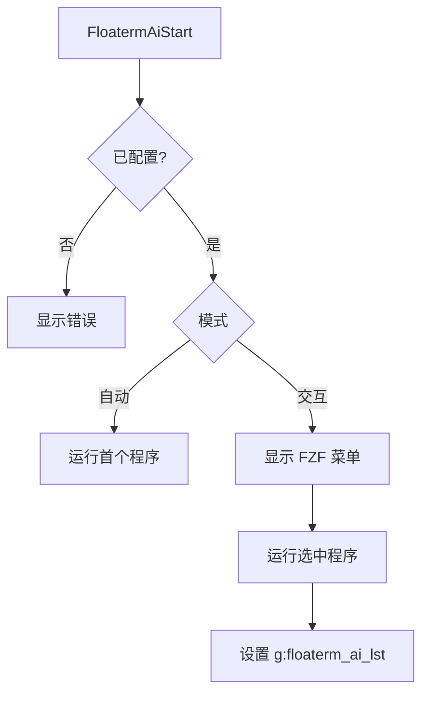
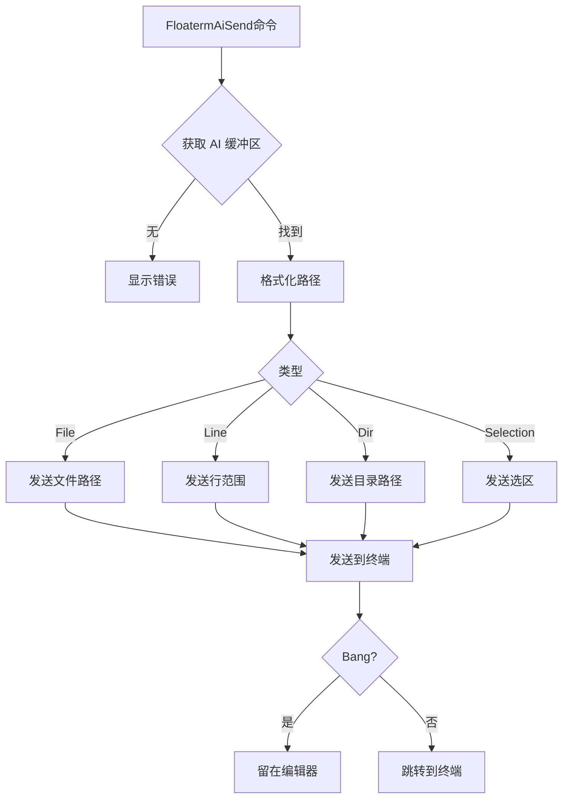
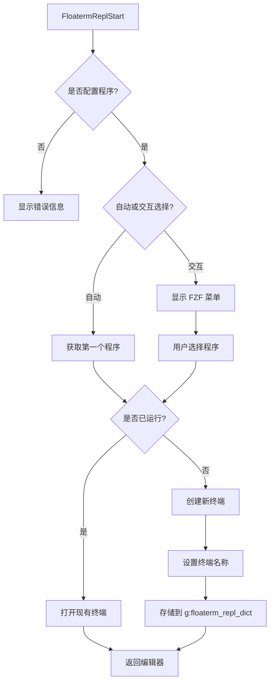
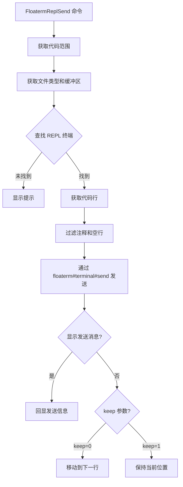
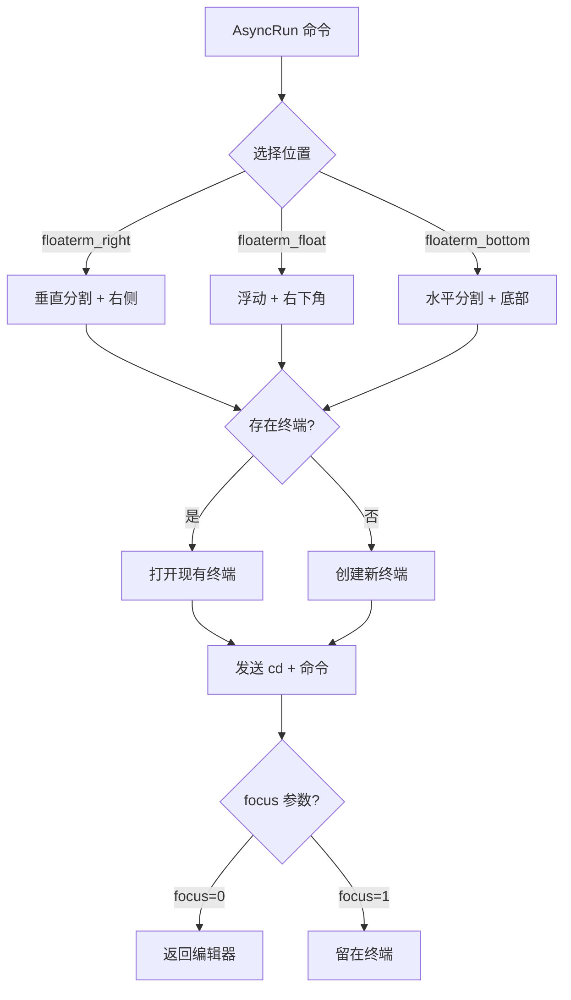

# vim-floaterm-enhance

[English Document](README.md)

这是一个基于 [vim-floaterm](https://github.com/voldikss/vim-floaterm) 的 Vim 插件，用于增强浮动终端的功能。本插件提供 AI 交互、REPL 集成以及 AsyncRun 支持等主要功能。

# AI 集成 (AI Integration)

该模块允许你将上下文（文件、代码行、目录）发送到运行在浮动终端中的 AI 工具。它旨在与接受输入或上下文参数的 CLI AI 工具（如 `mods`, `aichat`, `sgpt` 等）配合使用。

## AI 流程概览

### 1. 启动流程



### 2. 发送上下文流程



## AI 命令

| 模式 | 命令 | 功能描述 |
| :--- | :--- | :--- |
| **启动控制** |
| n | `:FloatermAiStart` | 启动 AI (交互式选择) |
| n | `:FloatermAiStart!` | 启动默认 AI (立即执行) |
| n | `:FloatermAiSendCr` | 向 AI 终端发送回车键 |
| **发送上下文** |
| n/v | `:FloatermAiSendLineRange` | 发送当前行/选区,执行后跳转到 AI 终端 |
| n/v | `:FloatermAiSendLineRange!` | 发送当前行/选区,执行后保持在当前缓冲区 |
| n | `:FloatermAiSendFile` | 发送当前文件路径,执行后跳转到 AI 终端 |
| n | `:FloatermAiSendFile!` | 发送当前文件路径,执行后保持在当前缓冲区 |
| n | `:FloatermAiSendDir` | 发送当前目录路径,执行后跳转到 AI 终端 |
| n | `:FloatermAiSendDir!` | 发送当前目录路径,执行后保持在当前缓冲区 |
| n | `:FloatermAiFzfFiles` | 通过 FZF 选择文件发送,执行后跳转到 AI 终端 |
| n | `:FloatermAiFzfFiles!` | 通过 FZF 选择文件发送,执行后保持在当前缓冲区 |

> **说明**: 
> - 命令后带 `!` 表示执行后光标**保持**在当前编辑器窗口
> - 命令不带 `!` 表示执行后光标**跳转**到 AI 终端窗口
> - 模式: `n` = normal 模式, `v` = visual 模式

---

# REPL 集成 (REPL Integration)

该模块允许你将编辑器中的代码片段发送到运行在浮动终端中的 REPL (交互式解释器) 执行。

## REPL 流程概览

### 1. 启动流程



### 2. 代码发送流程



## REPL 命令

| 模式 | 命令 | 功能描述 |
| :--- | :--- | :--- |
| **启动控制** |
| n | `:FloatermReplStart` | 启动 REPL (交互式选择) |
| n | `:FloatermReplStart!` | 启动默认 REPL (立即执行) |
| n | `:FloatermReplSendCrOrStart!` | 发送回车键或启动 REPL (保持在编辑器) |
| n | `:FloatermReplSendExit` | 发送退出命令到 REPL |
| n | `:FloatermReplSendClear` | 发送清屏命令到 REPL |
| **发送代码** |
| n/v | `:FloatermReplSend` | 发送当前行/选区,光标移动到下一行 |
| n/v | `:FloatermReplSend!` | 发送当前行/选区,光标保持在当前位置 |
| n/v | `:FloatermReplSendBlock` | 发送代码块 (由 `%%` 标记),光标移动到下一行 |
| n/v | `:FloatermReplSendBlock!` | 发送代码块 (由 `%%` 标记),光标保持在当前位置 |
| n | `:FloatermReplSendToEnd!` | 发送从当前行到文件末尾的内容,光标保持位置 |
| n | `:FloatermReplSendFromBegin!` | 发送从文件开头到当前行的内容,光标保持位置 |
| n | `:FloatermReplSendAll!` | 发送整个文件内容,光标保持位置 |
| n/v | `:FloatermReplSendWord` | 发送光标下的单词或选区 |
| **标记功能** |
| n/v | `:FloatermReplMark` | 标记当前选区以便后续发送 |
| n | `:FloatermReplSendMark` | 发送之前标记的代码 |
| n | `:FloatermReplShowMark` | 显示之前标记的代码内容 |

> **说明**: 
> - 命令后带 `!` 表示光标**保持**在当前位置
> - 命令不带 `!` 表示光标**移动**到下一行(便于连续执行)
> - 模式: `n` = normal 模式, `v` = visual 模式

---

# AsyncRun 集成 (AsyncRun Integration)

除了 REPL 和 AI 功能外，本插件还提供了与 [asyncrun.vim](https://github.com/skywind3000/asyncrun.vim) 的集成，可以在浮动终端中运行程序。

## AsyncRun 流程



## 功能特性

以下runner被自动注册：

* **`floaterm_right`**: 在右侧垂直分割终端中运行命令
* **`floaterm_float`**: 在浮动终端窗口中运行命令
* **`floaterm_bottom`**: 在底部水平分割终端中运行命令

## 使用示例

```vim
" 在浮动终端中运行简单命令
:AsyncRun -mode=term -pos=floaterm_float echo "Hello, World!"

" 在右侧终端中运行 Python 脚本
:AsyncRun -mode=term -pos=floaterm_right python %

" 在底部终端中运行 Node.js 脚本
:AsyncRun -mode=term -pos=floaterm_bottom node %
```

# 核心架构变量

| 组件 | 变量/函数 | 类型 | 说明 |
|------|----------|------|------|
| **AI 缓冲区列表** | `g:floaterm_ai_lst` | 全局列表 | 存储 AI 终端的缓冲区号 |
| **AI 程序** | `g:floaterm_ai_programs` | 全局字典 | AI 命令列表 |
| **REPL 映射** | `g:floaterm_repl_dict` | 全局字典 | 映射 `{filetype}-{bufnr}` → 终端 bufnr |
| **REPL 程序** | `g:floaterm_repl_programs` | 全局字典 | 文件类型 → REPL 命令列表 |
| **分割比例** | `g:floaterm_prog_split_ratio` | 全局浮点 | 分割窗口比例 (默认: 0.38) |
| **浮动比例** | `g:floaterm_prog_float_ratio` | 全局浮点 | 浮动窗口比例 (默认: 0.45) |
| **位置阈值** | `g:floaterm_prog_col_row_ratio` | 全局浮点 | 自动位置的宽高比阈值 (默认: 2.5) |

# 需求

## 基础环境
- 有`:terminal` 命令的 vim 或 neovim, 具体版本需求要比 [vim-floaterm](https://github.com/voldikss/vim-floaterm) 要高一些
- 安装 [asyncrun.vim](https://github.com/skywind3000/asyncrun.vim)

## AI 功能
- 安装支持命令行输入/上下文参数的 AI 工具，例如:
  - [mods](https://github.com/charmbracelet/mods) - 支持多种 AI 模型的命令行工具
  - [aichat](https://github.com/sigoden/aichat) - 命令行 AI 聊天工具
  - [sgpt](https://github.com/TheR1D/shell_gpt) - Shell GPT 工具
  - 其他支持 `@file` 或类似语法传递上下文的 CLI AI 工具

## REPL 功能
- 安装相应的 REPL 程序，例如:
  - Python: `ipython`, `python`
  - R: `radian`, `R`
  - Node.js: `node`
  - 其他语言的交互式解释器

## AsyncRun 功能
- 相关运行程序: `python`, `R`, `rustc`, `node`, `go` 等
